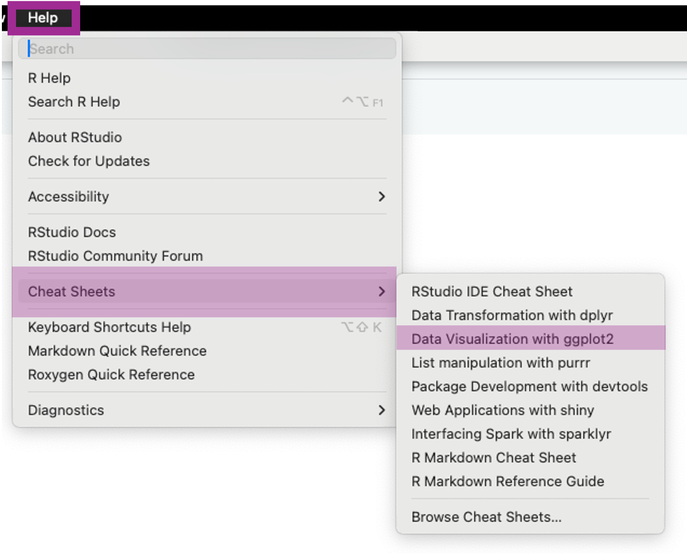
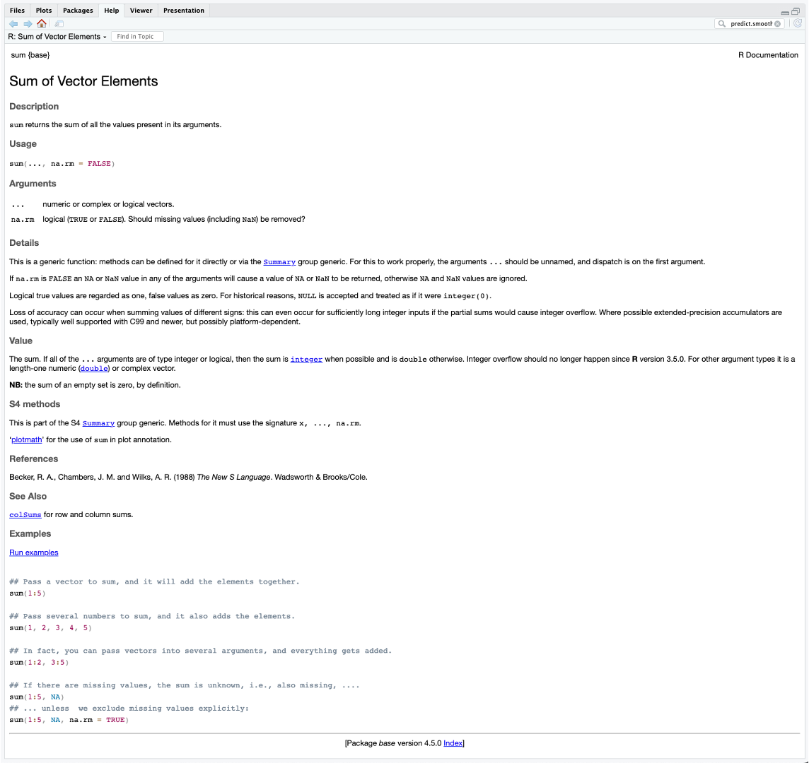
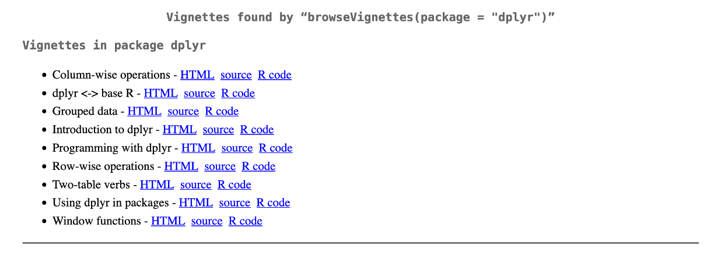
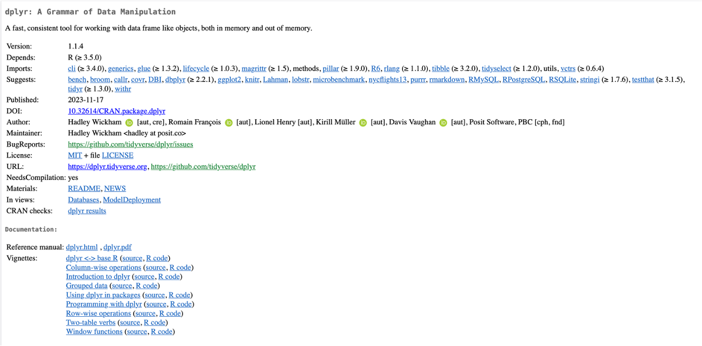

# Welcome to R {#ch-1}

## Coding to Spot and Prevent Errors

When writing code, the computer will only give you an answer if the input is correctly defined, and will only give the right answer if the input is correct.
For example, asking a computer to do the sum `2 + elephant` would be non-sensical and would result in an error.
This is an example of the input not being correctly defined.
If you wanted to find the sum of 2 and 3, but had a typo and asked for `2 + 4`, you would not get an error, as the inputs are correctly defined, but you would not get the correct answer, as the inputs are not correct.
Ensuring that the inputs are correct can sometimes be the harder error to spot, as they do not result in an error (at least at the point of the error).
However, errors in the definition of inputs can be just as challenging to solve after the initial error message.
As you work through this course, you'll learn about R and ways to write code, including writing scripts, loops (coming in Sections \@ref(sec:forLoops) and \@ref(sec:whileLoops)), functions, and more.
Here, we will outline a few tactics to ensure the code you write, whether a single line or a multi-document script, remains error-free and produces the expected outcomes.
We will also discuss strategies to identify where errors occur in larger scripts.

### Unit Testing {#sec:UnitTesting}

The first rule of programming is that it should be built up in small steps, and each step should be tested before the next is built.
Ideally, the larger code is composed of smaller functions that can be individually tested, known as unit testing.
Unit testing checks that your code takes the correct inputs and returns the correct outputs, and, where necessary, tests "edge cases".
If we take the example from before of a function that adds exactly two numbers, we would write some unit tests.
These could include:

* Is the output for `3` and `4 = 7`? (testing baseline functionality)
* If I give the function three numbers, does it return either an error or a warning that the third number is being ignored? (checking that no more than two inputs are being added)
* If I give the function one number, does it return an error? (checking that it doesn't try to add fewer than two numbers)
* Is the output for `2.5` and `3.2 = 5.7`? (checking that it can handle more than integers)
* Is the output for `2` and elephant an error? (checking that it cannot accept character strings and errors appropriately)
* Is the output for `-1` and `-4 = -5`? (checking that it can correctly handle negative numbers)
* Is the output for `-1` and `3 = 2`? (checking that it can handle negative and positive numbers)
* Is the output for `0` and `0 = 0`? (checking that it can handle zero and identical inputs)

Unit tests are specific to each function and must be written to identify potential problems.
This is why writing small functions are preferable to large functions, as the testing can be more specific.
Tests should have a known output to ensure that the functions are returning the expected output, as there is no point in testing something where you don't know what the output is supposed to be.
If the unit test fails, then you need to work out why and fix it before moving on.
The skills to work out why are also relevant to picking up errors that come from scripts and functions, regardless of whether you are unit testing.

### Understanding Error Messages {#sec:ErrorMessages}

Error messages should be written in a way that points to where and why the error occurred.
In theory, this should make the error really easy to spot, but in practice, it does not always work that way.
Some typical error messages might include the following.

* `object 'X' not found` - this means that you haven't previously defined `X` and if you look in the Environment (this will be further expanded on Chapter \@ref(ch-2)) you will not find anything under `X`. This could be because you previously defined it and then cleared it, or you are looking for a variable in a data.frame without telling R where the variable is located in, or that you defined it in a loop/function that you then exited or that it hasn't been introduced to the function
* `unexpected '=' in ...` where any other symbol could also be included (e.g. `(`, `}`, `*`, `$`, and many others) and `...` is the line of code where the unexpected symbol is. This normally means you have either left in a symbol where you should have deleted it (like an extra closing bracket), or you've not properly defined the inputs for the function you are using
* `could not find function 'pivot_longer()'` probably means you have not loaded the package with the function you are trying to use, or that you have mistyped the function name

### Looking Inside Functions

When writing your own code and functions, it is sometimes easiest to evaluate any issues in the middle of execution.
The simplest approach is to add print statements. These are useful to check whether a loop is iterating correctly or if an if / otherwise statement is working as expected.
You can print the counter (`print(i)`) or some of the data (`print(data)`) or even just a message (`print("success")`).
For more complex error identification, browser or break points within the file (click to the left of the line number in RStudio) pause the evaluation of a function when it is run, allowing you to see the state of the function and work through step by step while the function is running.
It is also possible to set a general option that whenever an error occurs, rather than returning an error message, you enter browser mode as if you had used the browser function, by using `**options(error = browser)**`.

## Help I'm Stuck

This course and guide are intended to provide an introduction to R, which means that you can start to use R and RStudio more widely.
Inevitably, as you use R more, you will come across questions on how to accomplish things, whether that is trying to determine whether you are using a function correctly, whether the method you are using is the most appropriate, or whether someone has already done what you are trying to do and can save you time by sharing a potential solution.
This guide can be a good starting point to try to answer these questions, but it will not provide all the answers.
Therefore, we have compiled a few other places to look for solutions.

### Cheat Sheets {#sec:cheetSheets}

Within RStudio, there are some cheat sheets that are easily accessible.
For the purposes of this course, the following are the most useful:

* [RStudio **\acr{IDE}** cheat sheet](https://raw.githubusercontent.com/rstudio/cheatsheets/main/rstudio-ide.pdf)
* [Data transformation with dplyr](https://raw.githubusercontent.com/rstudio/cheatsheets/main/data-transformation.pdf) (see Chapter \@ref(ch-3) for more information on dplyr)
* [Data Visualization in ggplot2](https://raw.githubusercontent.com/rstudio/cheatsheets/main/data-visualization.pdf) (see Chapter \@ref(ch-4)  for more information on ggplot2)
 
Using the ggplot2 cheat sheet as an example, they can be found under Help -> Cheat Sheets -> Data visualisation in ggplot2.

```{r cheatSheets, echo=FALSE, fig.cap="How to access data visualisation cheat sheets in R", out.width="50%", fig.align='center'}

```

As you can see, there are more cheat sheets available within that menu, and even [more cheat sheets](https://posit.co/resources/cheatsheets/?type=posit-cheatsheets/) are available under "Browse Cheat Sheets..."

### `help` Function in R {#sec:RHelp}

To understand how a specific function works, there are two functions you can use: `help` or `?`.
This will open some documentation under the **Help** tab within **RStudio**. This documentation provides a brief description of the function.
It also includes an example of its use that covers various input arguments, default values for optional arguments, written descriptions of both required and optional arguments, and other relevant information, such as references, similar functions, and worked examples.
Using an example for the function `sum`, from the base package, which is a function used to add a list of numbers together, the help documentation looks like Figure \@ref(fig:example-help).
To access the help documentation, we have to type `help(sum)` or `?sum` into the console and then press enter.

```{r example-help, echo=FALSE, fig.cap="The documentation for `help(sum)` or `?sum`", out.width="95%", fig.align='center'}

```

### Reference Manuals and Vignettes {#sec:RefManAndVignettes}

Many packages have reference manuals which describe each function within the package.
These can be very technical and inaccessible for someone starting out, or trying to understand how to use the functions.
These reference manuals are a compilation of the outputs for `help` for every function within a package.

```{r example-vignette, echo=FALSE, fig.cap="The vignettes available for dplyr as shown when using the browseVignettes function", out.width="80%", fig.align='center'}

```

Most packages also come with user guides known as vignettes.
Within RStudio, these can be found by typing `**browseVignettes(package = "dplyr")**` (using dplyr here as an example package) and then pressing Enter.
This will open a new page on your web browser with links to the vignettes available for the package as seen in Figure \@ref(fig:example-vignette).
Vignettes can also be found on the CRAN page for the package, which is also where the full reference manuals can be found, as seen in Figure \@ref(fig:dplyr-CRAN).

```{r dplyr-CRAN, echo=FALSE, fig.cap="The CRAN page for the dplyr package, including urls to the reference manuals and the vignettes", out.width="80%", fig.align='center'}

```

### Stack Overflow {#sec:StackOverflow}

You are very unlikely to come across a problem that is not at least similar to something someone else has encountered, and with the power of the internet, we can be connected to all the people who have tried before us.
[Stack Overflow](https://stackoverflow.com/questions) is a website where people go to ask for help with programming questions.
Often, if you Google a question, a Stack Overflow page will come up as a suggestion, and more often than not, there will be a solution in the answers.
Answers are provided by other users, and up- and down-voted according to how helpful people find them.
[An example](https://stackoverflow.com/questions/35090883/remove-all-of-x-axis-labels-in-ggplot/35090981) of a resolved question in R (that you should be able to answer yourself by the end of this course) is one about removing axis labels from a plot in ggplot2.
The person asking the question provided some simple code that showed the issue without any irrelevant code (called a minimal reproducible example [**\acr{MRE}**] or minimal working example [**\acr{MWE}**]).
Then the person answering gave a very short response, again with a code example, that provides the solution.
Stack Overflow also tends to be very useful when you come across an error you've not encountered before.
For example, [this person](https://stackoverflow.com/questions/26247429/data-manipulation-in-r-x-must-be-atomic) found an error when trying to sort some data, and someone has provided both a solution and an explanation for the error.
Stack Overflow is part of a larger group of websites called the Stack Exchange, which all function in the same way.
Often stats questions can be answered from the [stats version](https://stats.stackexchange.com/) of Stack Overflow.

### Other {#sec:OtherUsefulResources}

There are other sources of information when struggling with a problem in R

* [R-bloggers](https://www.r-bloggers.com/) has blogs dedicated to different topics
* [A selection of useful data science resources](https://github.com/jocelynfriday/UsefulDataSceinceResources) compiled by Jocelyn Friday
* [Tutorials](https://www.w3schools.com/r/) for learning R