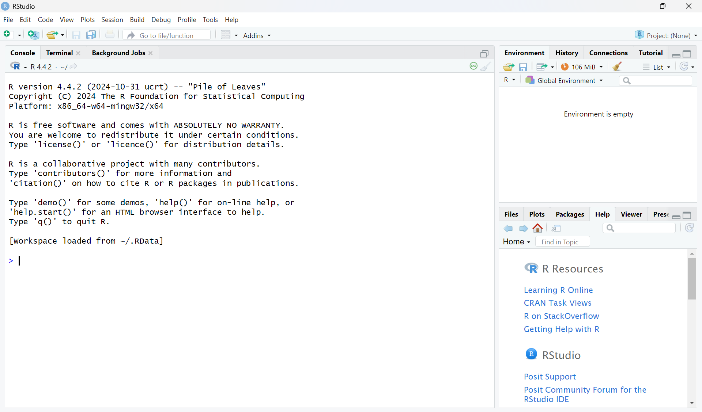
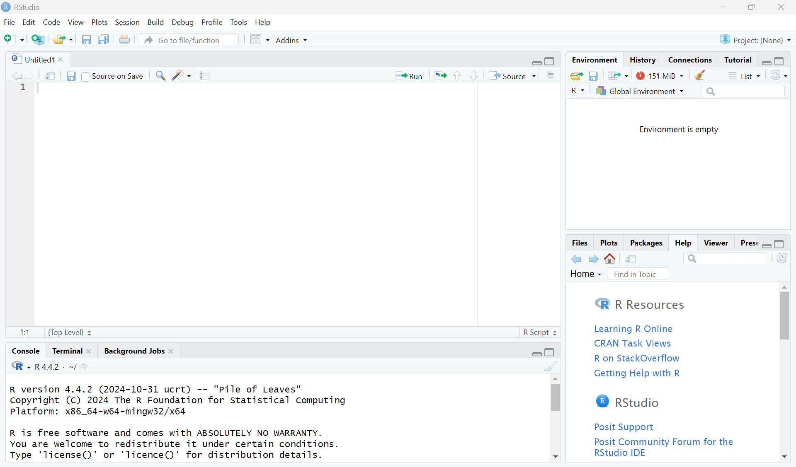
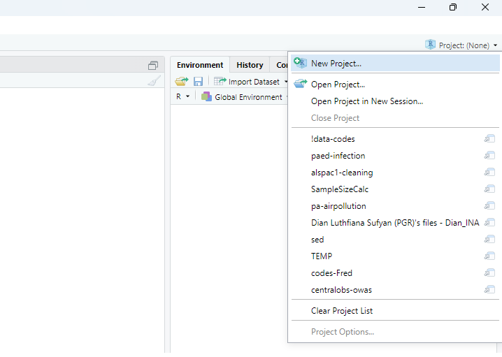
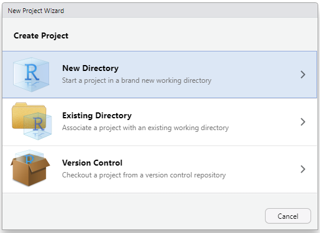

# Introduction and basic usage {#ch-2}

## What are R and RStudio?

R is a programming language. Like any language, it gives you the ability to communicate, in this case with your computer. By writing R code, you can give your computer instructions to carry out. 

RStudio is an **\acr{IDE}**. You can use R without RStudio, but RStudio provides a user-friendly method of using R to communicate with your computer. If you want to use R and RStudio on your computer or laptop, you first need to download and install them. You can download R from here: <https://cloud.r-project.org/>, and RStudio from here: <https://posit.co/download/rstudio-desktop/>. Make sure to select the version that matches your operating system (e.g., Windows, macOS, or Linux) when downloading.

## Why use R?

Many programmes and languages can be used for statistical analysis and data management, but there are several advantages to using and learning R. 

While R is not as feature-rich as Python and SAS, it is an all-rounder that can accomplish a wide variety of tasks, e.g., from managing data easily with dplyr and making beautiful graphs with ggplot2, to fitting *P*-splines in generalised additive models using mgcv and causal mediation analysis using CMAverse. If you are analysing big data with a lot of repetition, you can also speed things up with the (relatively) efficient parallel computing with furrr and doParallel (outside the scope of this course). R also has some capabilities as a general programming language, such as managing file systems (e.g., creating, moving, and deleting files). You can also use R to write replicable reports using **R Markdown** or **Quarto**, and interactive websites and dashboards using `shiny`. Lastly, R is free and open source, and it is one of the most widely used languages for statistics and data science. This makes it a valuable skill for careers such as data analyst or data scientist across many fields.

## Using R and RStudio {#sec:UsingRStudio}

The first time you open RStudio after installing it, it will look like this:


```{r home-RStudio-screen, echo=FALSE, fig.cap="Home RStudio Screen highlighting the console", out.width="100%", fig.align='center'}

```

The large window on the left is called the **console** pane. In the console, you can type a command, which will appear next to the blue arrow (>). If you press Enter, R will execute your command and display the result. Try running the following code and see what happens:

::: {.yellowbox}
```{r}
2+2
```
:::

You can also assign a value to a variable, which allows you to reuse the value that is now stored in a. Try typing in your console:

::: {.yellowbox}
```{r}
a <- 3
```
:::

Next, look at the Environment pane in the top right. This pane shows you the variables you have created. You should be able to see that the value "3" is now associated with your variable "a". Try typing in your console:

::: {.yellowbox}
```{r}
a
```
:::

The console should return "3" to you. You could also create a vector of values, and assign this to a variable:

::: {.yellowbox}
```{r}
v <- c(1, 5, 8)
v
```
:::

## R scripts

For simple commands, you can use the console as shown above. However, for more complicated tasks, it will be easier to create an R script. You can create an R script by clicking on File > New File > R Script. This will open an R file in which you can write your code. RStudio should then look like this:


```{r blank-R-script, echo=FALSE, fig.cap="Home RStudio Screen highlighting a blank R script", out.width="100%", fig.align='center'}

```

The top left window is the empty script. Add the following code to your R script:

::: {.yellowbox}
```{r}
a <- 3
b <- 10
c <- 5
(a+b)*c
```
:::

The calculation adds two numbers and then multiplies this sum by a third number. You can run the script line by line by pressing the Run button repeatedly. You can also run the entire script by pressing the Source button. You can use the drop-down menu next to the Source button and click on "Source with Echo" to ensure your code and its output are printed to the console. Once you have run the script, the Environment pane displays all the variables you created (a, b, c) along with their values.

Once you have created a script, you can save it, so that you can reuse it again later. You can do this by clicking File > Save or File > Save As... and specifying a name for your script.

## R functions {#sec:functions}

If you wanted to do the same calculation multiple times, but for different numbers, you could create something called a function. A function takes an input and uses it to produce an output by using the code defined within the function. Functions can be called multiple times, helping to avoid unnecessary code duplication.

The following code defines the function **`sum_and_multiply()`**, and calls it with multiple different number combinations as inputs. **Try it out!**

::: {.yellowbox}
```{r}
sum_and_multiply <- function(a, b, c) {
  (a+b)*c
}

sum_and_multiply(2, 4, 10)
sum_and_multiply(6, 8, 2)
sum_and_multiply(1, 5, 2)
```
:::

::: {.pinkbox}
Now try writing your own function!
:::

What if you now wanted to calculate the mean and the **\acr{SD}** of a series of numbers? You could again write your own function. Alternatively, you can use existing functions. R has a large number of built-in functions that are ready to use. The functions **`mean()`** and **`sd()`** can be used to calculate the mean and standard deviation, respectively. You can use the **`help()`** function or place a "?" in front of your function. This will provide access to the documentation pages of that function and provide guidance on how to use it.

::: {.pinkbox}
Try this:

```{r, eval=FALSE}
utils::help(mean)
```

and this:

```{r, eval=FALSE}
?sd
```

The documentation should have appeared in the bottom-right corner of RStudio. Did the documentation give enough information to use these two functions?
:::

Here is one way in which you can calculate the mean and standard deviation of a series of numbers: 

::: {.yellowbox}
```{r}
x <- c(1, 4, 7, 3)
base::mean(x)
stats::sd(x)
```
:::

## Environment and scope {#sec:scope}

The above examples have shown how to create and save data in R. By default, these data are stored in the **global environment**, which is accessible to all functions in R. However, variables created inside a function are generally only available within that function's scope and are not accessible to other functions. Below is an example of calculating the area of a right-angled triangle:

::: {.yellowbox}
```{r}
area <- function(base, hypotenuse){
  x <- base * hypotenuse
  return(x / 2)
}

area(3, 2)
x
```

:::

Note: even though we have run the **`area()`** function, we can't recall the value of x (which is defined and calculated inside that **`area()`** function. This is because the value of x was not saved in the global environment and is gone as long as the function call is finished. This concept is not necessary to understand to use R, however it is useful for anyone who may use functions in the future.

## Packages

Base R encompasses all the functions and features included with R upon installation. The double-colon operator '::' tells R to select definitions from the named package on the right. For example, mean and sd are examples of base R functions. Other R users have created their own functions and shared them online as installable packages, enabling others to use them for free. These are not part of base R and, therefore, need to be installed separately. Most R packages can be found on CRAN (<https://cran.r-project.org/>). To install a package from CRAN, you can use the install.packages function. Let's say you wish to now calculate the **\acr{SE}** of a series of numbers. You can calculate this by using a formula, but you can also use an already existing function. The package plotrix contains the function std.error, which can calculate this. plotrix is not part of base R, so needs to be installed.

::: {.pinkbox}
Try:

```{r, eval=FALSE}
utils::install.packages("plotrix")
```
:::

To use a package you installed, you first need to load it with the `library()` function. You should then be able to use the std.error function:

::: {.yellowbox}
```{r}
base::library(plotrix)

plotrix::std.error(x)
```
:::

::: {.pinkbox}
Can you find a different function that is not part of base R, install the relevant package, and use it?
:::

## Reserved words {#sec:reservedWords}

R has reserved words that have a special meaning within the language. You cannot use them as a function or a variable name. To find out what the reserved words are, you can type:

::: {.yellowbox}
```{r, eval=FALSE}
?reserved
```
:::

From the list, you can see that "if" and "else" are reserved words. Try writing:

::: {.yellowbox}
```{r,error=TRUE}
if <- 3
```
:::

As expected, the R console will print an error, and will not have assigned the value "3" to "if". R is case sensitive. This means that it distinguishes between if, If, iF, and IF. This means that you would be able to assign a value to If, iF, or IF. Try it:

::: {.yellowbox}
```{r}
If <- 3
```
:::

Now, the value of "3" should be assigned to If.

## Error vs warning messages {#sec:ErrorVsWarning}

In the previous section, the R console printed an error message and did not run the code. Running R code can also generate warning messages. The code will still run, but may not behave as expected. Here is an example of that code that runs, but will generate a warning message:

::: {.yellowbox}
```{r}
v <- c("1", "2", "3")
base::mean(v)
```
:::

You may expect the output of the above code to be 2. However, the function mean expects its input to be a vector of numbers, not strings. Therefore, the code produces a warning message, and **\acr{NA}** as the output.

## Working directory {#sec:WorkingDirectory}

R allows you to read files from your computer and save files to it. How does R know where to read from or save to? You can provide a full file path. If no full path is provided, R assumes the file is located in the working directory. The working directory is the default location on your computer where R reads and saves files. To find out what your working directory is, type `getwd()`:

::: {.yellowbox}
```{r}
getwd()
```
:::

Are you happy with that working directory? If not, you can change it using `setwd()`:

::: {.yellowbox}
```{r, eval=FALSE}
setwd('path')
```
:::

To demonstrate the working directory, you can create a simple text file called "R output.txt" by using the command `writeLines()`. Please note that the command will overwrite any existing text file with the same name.

::: {.yellowbox}
```{r eval=FALSE}
base::writeLines("Hello World", "R output.txt")
```
:::

Open your file explorer and navigate to your working directory. You should be able to find the file `R output.txt`, with the line `Hello World` within it.

Please note: you can also set your working directory by clicking Session > Set Working Directory > Choose Directory (or source file location).

## Import data

The examples above used data that were input directly into R's console. However, real-world data analysis typically utilises data stored in files on either local or network drives. In those scenarios, you will need to import the data from the files into R. The exact functions used to import data depend on the data format. One of the most common formats of data is a **\acr{CSV}** file, and we will use that as an example. Please download **02-hrqol_data.csv** from Moodle, and place it in a convenient folder. For example, if you have put the data file in **`C:/Users/ABC/R_course/Data`**, then you can import the data using `read.csv()`:

::: {.yellowbox}
```{r}
dat <- utils::read.csv("./data/02-hrqol_data.csv")
```
:::

Note that the code not only imports the data, but also stores the imported data in a data frame object called **`dat`** (see Section \@ref(sec:dataFrame)). It is common practice to store the imported data in an object, because without doing so, you cannot interact with the data after loading it.

Below is a table showing common data formats and some functions to import them:

```{r data-import, echo=FALSE}
tab_import <- data.frame(
  `File format (file name extension)` = c(
    "CSV (.csv)", "TSV (.tsv)", "TXT (.txt)", "Excel data file (.xlsx / .xls)", 
    "STATA data file (.dta)", "SPSS data file (.sav)", "SAS data file (.sas7bdat)"
  ),
  `base R` = c("read.csv", "read.table", "read.delim", "", "", "", ""),
  `Using additional packages` = c(
    "read_csv", "read_tsv", "read_delim", "read_excel", "read_dta", "read_sav", "read_sas"
  ),
  check.names = FALSE
)
knitr::kable(tab_import, caption = "Functions to import data into R")
```

If you haven't installed those additional packages (readr, readxl, haven), the code on the right column won't work. You must install the package as described in the above section before running the code. Also note that the readr in the read_csv command means that the read_csv function is in the readr package specifically.

## Export data

If you have made changes to the data in R and want to export a copy to a local or network drive. You can export data in a similar way with `write.csv()`:

::: {.yellowbox}
```{r, eval=FALSE}
utils::write.csv(dat * 2, 'C:/Users/ABC/R_course/Data/test_data_new.csv')
```
:::

As with data import, R can export data in various formats using different packages.The corresponding functions are listed in the table below:

```{r data-export, echo=FALSE}
tab_export <- data.frame(
  `File format (file name extension)` = c("CSV (.csv)", "TSV (.tsv)", "TXT (.txt)", "Excel data file (.xlsx)", "STATA data file (.dta)", "SPSS data file (.sav)", "SAS data file (.sas7bdat)"),
  `Base R` = c("write.csv", "write.table", "writeLines", "", "", "", ""),
  `Using additional packages` = c("write_csv", "write_tsv", "write_delim", "write_xlsx", "write_dta", "write_sav", "write_sas"),
  check.names = FALSE
)
knitr::kable(tab_export, caption = "Functions to export data from R")
```

Be aware that some data formats may not correspond to the standard extension. For example, a data formatted as **\acr{TSV}** could have an extension of '.txt'. If the imported data doesn't make sense (e.g., only one column), please review the imported data and determine if a different function should be used instead. Also note that the Excel data requires a different package for export than it did for import (writexl).

## Project {#sec:project}

The **Project** functionality in R is a good way to manage different projects. For example, you can use one project for all scripts for this course and another project for your **\acr{MPH}** project (if you decide to use R for it).

The main advantage of using the **project** functionality is that the **working directory** is set automatically to your project folder, and it could be easier to import data or scripts into R without using absolute paths. For example, if you have a project folder **`"C:/Users/ABC/R_course/"`** for this course, and the data '02-hrqol_data.csv' located in the **`"C:/Users/ABC/R_course/Data/02-hrqol_data.csv"`**, you can either read in the data using an absolute path:

::: {.yellowbox}
```{r, eval=FALSE}
dat <- read.csv("C:/Users/ABC/R_course/data/02-hrqol_data.csv")
```
:::

Or using a relative path, if your working directory is set correctly (or if you use the Project function):

::: {.yellowbox}
```{r, eval=FALSE}
dat <- read.csv("data/02-hrqol_data.csv")
```
:::

Similarly, you can use a relative path when you export files.

To create an R Project, you can click on the project button in the top-right corner of your RStudio. 


```{r project-menu, echo=FALSE, fig.cap="Project Menu in RStudio", out.width="75%", fig.align='center'}

```

You then can create a project by clicking the **New Project...** button, which then gives you an option to create a new project by creating a new folder (which would be empty) or to create a new project based on an existing folder (where there may already be data and other relevant files in it). In Figure \@ref(fig:project-menu), you can also see that all recent projects that you have used are listed there, which could be handy to switch between ongoing projects.


```{r new-project-wizard, echo=FALSE, fig.cap="Options to create a new project", out.width="75%", fig.align='center'}

```

## R Markdown {#sec:RMarkdown}

R Markdown enables you to combine code, code output, images, and plain text into one document (Word, **\acr{PDF}** or **\acr{HTML}**). R Markdown lets you directly produce a nicely formatted report, without needing to copy and paste the results of your analysis into a separate document.

Using R Markdown can be more efficient, transparent, and supports the reproducibility of your work. To use R Markdown you first need to install the rmarkdown package.

::: {.yellowbox}
```{r, eval=FALSE}
install.packages('rmarkdown')
```
:::

If you would like to create a **\acr{PDF}** or Word document using R Markdown, you will also need to have a version of LaTeX installed on your computer. If you do not yet have a version of LaTeX installed on your computer, tinytex (<https://yihui.org/tinytex/>) is a good choice. You can install rmarkdown and tinytex with the following commands:

::: {.yellowbox}
```{r, eval=FALSE}
utils::install.packages('tinytex')
tinytex::install_tinytex()
```
:::

You can create an R Markdown document by clicking New File > R Markdown... Give the document a title and add your name in the 'Author box', and click on 'OK'. This will create an R Markdown file. Save this file in your working directory. You can now knit it by clicking on the 'Knit' button. Wait for it to finish and have a look at the output.

You can also run the code sections ("chunks") without 'knitting' the document by pressing the green arrow in each chunk. Have a look at the Run drop-down menu for other Run options.

::: {.pinkbox}
Try adding some code and text of your own to your R Markdown file, run your code chunks, and knit the file to get a feel for how it works.
:::

## R coding tips {#sec:CodingTips}

The above examples are relatively simple. However, if you start writing more complicated and larger pieces of code, consistently formatting your code will help its readability, maintainability, and help you spot errors. Below are some tips for writing your R code.

### Indentation

Compare these two code snippets:

::: {.yellowbox}
```{r}
x <- 3

if(x %% 2 == 0) {
base::print("Even number")
} else if (x %% 2 == 1) {
base::print("Odd number")
} else
base::print("Number is neither even nor odd")
```
:::

::: {.yellowbox}
```{r}
if(x %% 2 == 0) {
  base::print("Even number")
} else if (x %% 2 == 1) {
  base::print("Odd number")
} else
  base::print("Number is neither even nor odd")
```
:::

The first code snippet does not use indentation (spaces at the beginning of a line of code), while the second does. Consistent use of indentation can aid readability.

### Commenting

For the code above, you may have inferred that it tells you whether a number is even or odd (or neither). However, you may not understand how it does that. Adding comments to your code can help explain to others how it works. It will also help you to understand your own code if you need to use or edit it in the future. You can add comments by using the "#" symbol. See below how the added comments help to clarify what the code does and how it accomplishes this.

::: {.yellowbox}
```{r}
# the following code determines whether a number is even, odd, or neither
# it does this by using the modulo (%%) operator
# the modulo operator returns the remainder of a division
# the remainder of an even number divided by 2 is 0
# the remainder of an odd number divided by 2 is 1
# the remainder of a decimal number divided by 2 is always another decimal number
# therefore, for a decimal number, the else condition would hold

if(x %% 2 == 0) {
  base::print("Even number")
} else if (x %% 2 == 1) {
  base::print("Odd number")
} else
  base::print("Number is neither even nor odd")
```
:::

::: {.pinkbox}
Try adding relevant comments to the function you wrote previously.
:::

### Naming conventions {#sec:NamingConventions}

Being consistent with how you name your variables and functions can further improve your code's readability. Try to choose names that are short and meaningful.

::: {.yellowbox}
```{r}
# short, but not informative
x <- "December"

# informative, but long
twelfth_month_of_the_year <- "December"

# both short and informative
month_12 <- "December"
```
:::

::: {.pinkbox}
Did the function you wrote previously have a short and meaningful name? If not, change it.
:::

It is also best not to reuse existing function names. Reusing a function name will overwrite the original function. Here is an example:

::: {.yellowbox}
```{r}
c <- function(a, b, c) {
  (a+b)*c
}
```
:::

The above code will overwrite the base R function c, which combines values into a vector (this will be covered further in Section \@ref(sec:vector)). If you were to use c again, it would refer to the function in the above yellow box.

### Style guides {#sec:styleGuides}

The above sections provide a few tips on how to improve the readability of your code. For further ideas/guidance on how to write and format your code, you can refer to a style guide. Here is an example of a style guide: [Tidyverse Style Guide](https://style.tidyverse.org/). Have a look!

## References/further reading

1. <https://rstudio-education.github.io/hopr/>
2. <https://intro2r.com/>
3. <https://docs.posit.co/ide/user/>