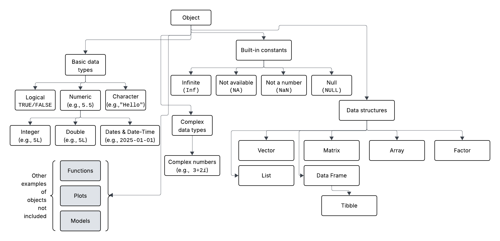
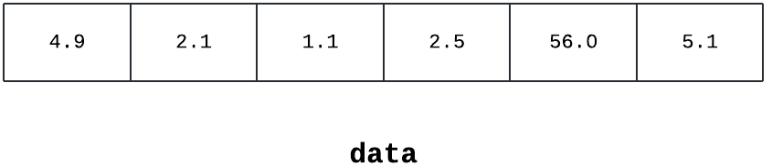
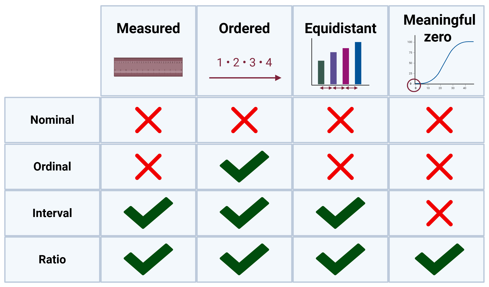
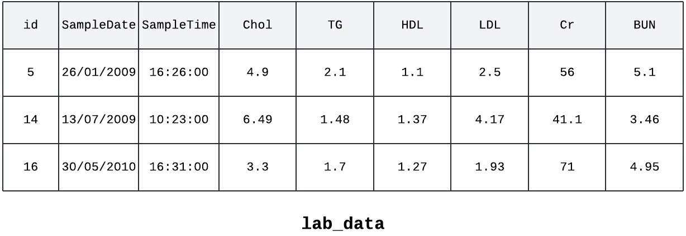
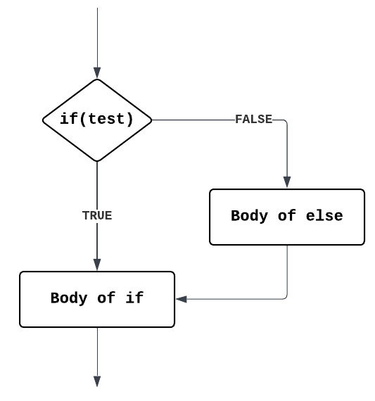
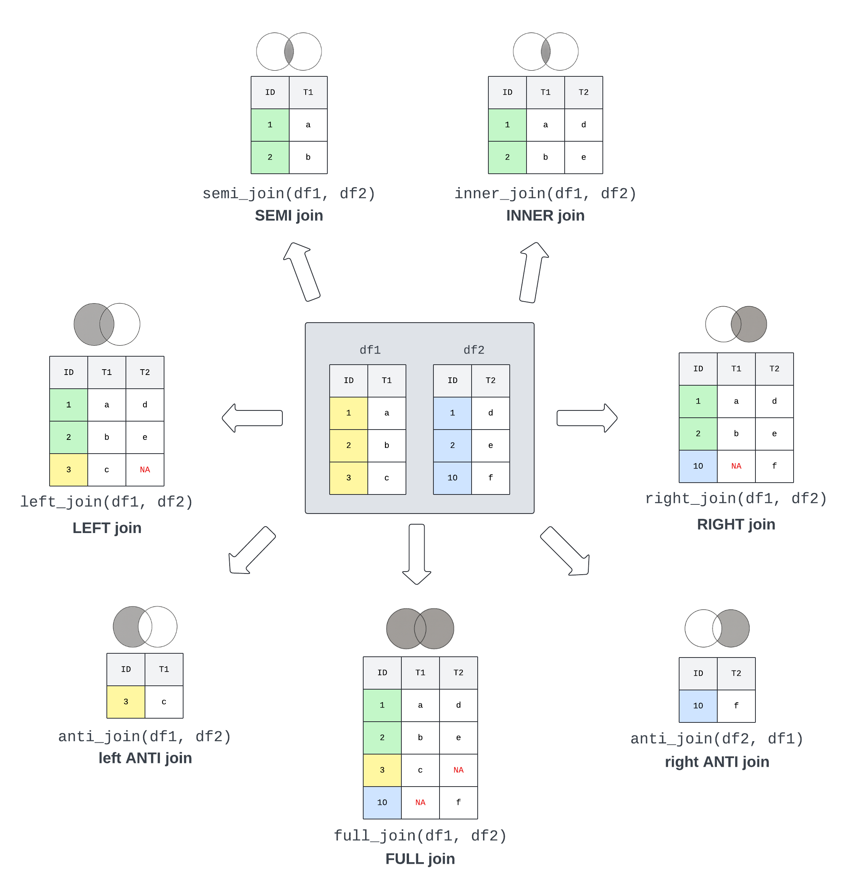

# Data Types & Manipulation {#ch-3}

```{r setup-ch3, echo=FALSE}
library(tidyverse)
library(survival)
library(hms)

rm(list=ls()); gc()
```

At the heart of almost all of R, nearly everything in R is an **object** of some form or fashion. These can be almost anything, from a single number or word to more complex things such as functions (as seen in Section \@ref(sec:functions)), data sets, plots (coming in Chapter \@ref(ch-4)), and analysis results (coming in Chapter \@ref(ch-5)). 

```{r object-hierarchy, echo=FALSE, fig.cap="A rough diagram of the object hierarchy of what will be covered in this chapter. Most things in R descend and inherit functionality from the main Object class, and as such are related. Examples of each object type have been presented in parentheses where possible. The information in the grey boxes either has been or will be covered in other chapters, and this does not include topics such as user-defined classes and objects.", out.width="95%", fig.align='center'}

```

Figure \@ref(fig:object-hierarchy) provides a rough outline of the chapter to come, starting with the basic and complex data types in Section \@ref(sec:dataTypes), followed by built-in constants in Section \@ref(sec:builtInConstants), then data structures in Section \@ref(sec:dataStructure), and concluding with data manipulation in Sections \@ref(sec:tidyverse)-\@ref(sec:logicFlow) and merging data sets in Section \@ref(sec:merging).

## Data Types {#sec:dataTypes}

R has object-oriented programming capabilities, which means that almost everything in R is an object which has a **class**. The class defines the object's type (e.g., what information it can hold) and how R behaves when functions (see Section \@ref(sec:functions)) are applied to it. This means that regardless of object type, the `class` function can be used to check the data type.

::: {.yellowbox}
Define a function and check its class:
```{r}
# Define the function
a <- function(){
    base::print("hello world")
}

# Check the class
base::class(a)
```
:::

These objects can be used to store different types of data, and each data type has inherently distinct properties, allowing R to use them for various tasks. In R, variables do not need to be declared as a specific type of data, as shown in Chapter \@ref(ch-2); an object can change type after having been set. This is distinctly different from languages such as Java and C++.

### Logical (Booleans) {#sec:boolean}

One of the most basic and simple data types in R are **logical** or **boolean** values, which can either be **`TRUE`** (`T` also works) or **`FALSE`** (or `F`).

::: {.yellowbox}
Check the class:
```{r}
# Of the straight boolean
base::class(TRUE)

# Or of an assigned variable
a <- FALSE
base::class(a)
```
:::

Rather self-explanatory, **logical** data are most often used when one is checking to see if an expression is either `TRUE` or `FALSE`. That is, when comparing values or objects, such as `x > 15` or `x < y`.

::: {.yellowbox}
Examples of expressions and their boolean results:
```{r}
# Expressions comparing two numbers
1 < 2
2 == 2
2 > 1

# Or comparing two variables
a <- 1
b <- 2
a < b
```
:::

#### Boolean with Comparison Operators

**Comparison operators** are used to compare two values and return a **boolean** value based on the result. The operators and examples are described in Table \@ref(tab:operators). 

```{r operators, echo=FALSE}
tab_operators <- data.frame(
  Operator = c(">", "<", "==", "!=", ">=", "<="),
  Description = c("Greater than", "Less than", "Equals to", "Not equal to", "Greater than or equal to", "Less than or equal to"),
  Example = c("`2 > 1` returns `TRUE`", "`2 < 1` returns `FALSE`", "`2 == 2` returns `TRUE`", "`2 != 2` returns `FALSE`", "`2 >= 1` returns `TRUE`", "`2 <= 1` returns `FALSE`")
)
knitr::kable(tab_operators, caption = "A table of the most common operators used to compare two values.")
```

#### Boolean with Logical Operators {#sec:logicalOperators}

Following on, **logical operators** are used to compare the output of two comparisons. The three options in R are: 

1. **`AND`** operator (`&`),
2. **`OR`** operator (`|`),
3. and **`NOT`** operator (`!`)

The **`AND`** operator takes a logical input on either side of the `&` and returns `TRUE` only if **both** sides of the `&` evaluate to `TRUE`.

::: {.yellowbox}
For example:
```{r}
# The following will evaluate to true:
TRUE & TRUE 

# while the following will evaluate to false
FALSE & TRUE
TRUE & FALSE
```
:::

::: {.pinkbox}
What do you think `FALSE & FALSE` will evaluate to? Note that both sides of `&` are the same. 
:::

Using the same format, the **`OR`** takes a logical input on either side of the `|` and returns `TRUE` if **either** side of the `|` evaluate to `TRUE`. As only one of the arguments needs to evaluate to `TRUE` for **`OR`** to be true, if the first argument evaluates as `TRUE`, the second will not be checked.

::: {.pinkbox}
What do you expect the following to evaluate?
1. `TRUE | TRUE`
2. `FALSE | FALSE`
3. `TRUE | FALSE`
4. `FALSE | TRUE`
:::

Conversely, the **`NOT`** operator `!` takes one logical input and negates (flips) it. So, if a value is `TRUE`, using `!` would negate it and turn it to `FALSE`, and vice versa.

::: {.yellowbox}
For example:
```{r}
# The following will evaluate to true:
!FALSE 
!FALSE & TRUE

# while the following will evaluate to false
!TRUE
!TRUE & TRUE
```
:::

Finally, the **`NOT`** operator can be combined with comparisons using parentheses to build more complicated comparisons. For example, `!(x > 10)` is equivalent to saying that `x` is not greater than 10, which means that it is less than or equal to 10, i.e., `x <= 10`. As an aside, the **`NOT`** operator (`!`) can also be used on functions that evaluate to booleans.

#### Operators and Precedence

In a similar vein to the order of operations in mathematics, R executes code based on a precedence, analogous to the mathematical order of operations (remember the acronym PEMDAS or BODMAS from maths at school?). In R and computational languages more broadly, this expanded to include things such as variable assignment logic.

```{r precedence, echo=FALSE}
tab_precedence <- data.frame(
  Order = c("1.", "2.", "3.", "4.", "5.", "6.", "7.", "8.", "9.", "10.", "11.", "12.", "13.", "14.", "15.", "16."),
  Operator = c("::", "$", "[, [[", "^", "+, -", ":", "%%, |>, %*%, etc.", "<, >, <=, >=, ==, !=", "!", "&", "|", "~", "->", "<-", "=", "?"),
  Meaning = c("Access functions and variables in a namespace", "Component extraction", "Indexing", "Exponentiation", "Characters representing the sign of a number (i.e., unary minus or plus)", "Sequence operator (e.g., 1:5)", "Special operators (e.g., %% for modulus, the remainder from division)", "Ordering and comparison", "Negation", "Logical AND", "Logical OR", "As found in formulae", "Rightward assignment", "Assignment (right to left)", "Assignment (right to left)", "Help")
)
knitr::kable(tab_precedence, caption = "A subset of the most common operators grouped and listed by order of precedence, i.e., order of execution.")
```

In particular, assignment operators have the (almost) lowest precedence; this means that variable assignment is the last thing that should be executed when processing a row of code. As seen in Table \@ref(tab:precedence), part of the reason for preferring a `<-` assignment operator for variables over a more traditional-looking `=`, is that R gives the former a higher precedence. Parentheses blocks, denoted with `()`, can be used to group comparisons or mathematical statements together to ensure that the code block inside is evaluated before continuing to the rest of the code.

::: {.yellowbox}
The logical `AND` (`&`) has higher precedence than `OR` (`|`):
```{r}
TRUE | TRUE & FALSE # this is equivalent to the following
TRUE | (TRUE & FALSE)

# Whereas, the "()" force the OR ("|") to evaluate first:
(TRUE | TRUE) & FALSE 
```
:::

::: {.pinkbox}
What happens if you flip the exercise, replacing the `ORs` with `ANDs`? Is this what you expect? 
:::

### Numeric {#sec:numeric}

A **Numeric** object or value contains only numbers (e.g., 1, 2, 5.5, pi, etc.).

::: {.yellowbox}
Check the class:
```{r}
# Of the straight number
base::class(5.5)

# Or of an assigned variable
a <- 5
base::class(a)
```
:::

Alternatively, `is.numeric` can be used to check to see if an object is **numeric**.

::: {.pinkbox}
What do you think the following code will evaluate to?

`x <- 5`
`base::print(base::is.numeric(x) & (x < 5 | x == 5))`

See Section \@ref(sec:logicalOperators) for help with logical operators.
:::

The numeric data type is R's default treatment for numbers and includes integers and doubles.

#### Integer {#sec:int}

**Integers** are the whole numbers that come to mind when thinking about a numeric value, e.g., 1, 2, 3, or 4. Integers are specified by putting a capital `L` after an integer value.

::: {.yellowbox}
Check the class:
```{r}
# Of a whole number
base::is.integer(1000)

# Of a specified integer
base::class(1000L)

# Or of an assigned variable
a <- 5333L
base::class(a)
```
:::

That being said, R handles the differences between the usual, unspecified numerics (see Section \@ref(sec:numeric)) and integers in the background, so they are often not noticed. The value of 1,000 has been deliberately chosen to show the differences and similarities between numeric and integer values.

::: {.yellowbox}
Background differences:
```{r}
base::is.numeric(1000)
base::is.integer(1000)
base::is.numeric(1000L)
base::is.integer(1000L)
```
:::

Think of **`integers`** as a subset of **`numeric`**, and follow a pattern of all **`integers`** are **`numeric`**, but not all **`numeric`** are **`integers`**.

#### Double {#sec:double}

**Doubles** are any numbers that have a decimal point. Take 5.0 or 5.5 for example.

::: {.yellowbox}
Check the class:
```{r}
# Of a double number
base::is.double(5.5)
base::typeof(5.5)
```
:::

As seen in Section \@ref(sec:numeric), the number 5.5 is also a **`numeric`**. Following the phrasing of integers above, all **`doubles`** are **`numeric`**, but not all **`numeric`** values are **`doubles`**.

#### Integers Versus Doubles

Programmers and analysts will typically use **`integers`** when they know that decimals will never be needed, for example, when dealing with IDs. The advantage is that **`integers`** take up less memory, but the trade-off is that they can only go a little more than two billion.

::: {.yellowbox}
Size and memory differences:
```{r}
# Maximum size of an integer
.Machine$integer.max

# Maximum size of a double (numeric) 
.Machine$double.xmax

# Implications of using integers versus numeric/doubles at scale (1 million)
ints <- base::rep(1L, 1e6)
numeric <- base::rep(1, 1e6)

## Check memory usage 
utils::object.size(ints)
utils::object.size(numeric)
```
:::

This clearly shows the two-time size difference between **`integers`** and **`doubles`**, which is why it is helpful to think about data types when working with data. The absolute difference (8 MB vs. 4 MB) may look small in this toy example. However, in real world data where you have multi-million rows, it would become important, especially because R needs to store all active data in the computer memory (RAM).

One place where it pays to be aware of **`integers`** versus **`doubles`** is when dividing. The result of the division (`/`) will always be a **`double`** because it is calculated using floating-point division.

::: {.yellowbox}
Differences in dividing:
```{r}
# Dividing numeric values 
x <- 5/2
base::print(x)
base::typeof(x)

# Dividing integers 
y <- 4L/2L
base::print(y)
base::typeof(y)
```
:::

::: {.pinkbox}
Can you think of three examples of when you would want to use an integer instead of a numeric value and vice versa?
:::

#### Dates and Date-times {#sec:datesAndTimes}

**Dates** (e.g., `"2025-01-01"`) and **date-times** (e.g., `"2025-01-01 10:30:00"`) are grouped under numeric data types because R actually stores dates in numerical format, technically based on the difference/distance from R's origin date of 1st January 1970. 

Working with time seems like an easy thing. For instance, it is easy to say that there are 365 days in a year, except for a leap year, which has 366 days. The convention, then, when converting days into years, is to split the leap day into 0.25 days per year, resulting in 365.25 days per year. Of course, time has an analogous issue surrounding daylight saving time, so one day a year will have 23 hours while another will have 25 hours. Furthermore, the application of daylight saving time is subject to various geopolitical factors. For this reason, the `lubridate` package has become the default when working with dates and times in R, and is fortunately part of the core `tidyverse` universe.

::: {.yellowbox}
Using the diabeticLabs dataset, explore the SampleDate column
```{r}
lab_data <- utils::read.csv("data/03-diabetic_labs_final_with_missing.csv", head = TRUE)

# Get a summary of the SampleDate 
head(lab_data, 3L)

# Get a summary of the data
summary(lab_data$SampleDate)

# check the format of the data
base::class(lab_data$SampleDate)
```
:::

From the `utils::head(lab_data, 3L)` call, the `SampleDate` column looks like valid dates, all be it specified in a `day-month-year` format, yet the `class` indicates that the column contains characters (see Section \@ref(sec:character)). If the data was used without converting it, R would not behave as expected.

::: {.yellowbox}
Try a character string comparison
```{r}
# Pick out the first row of the file for simplicity
lab_data <- utils::read.csv("data/03-diabetic_labs_final_with_missing.csv")
base::print(row <- lab_data[1,])

base::print(row$SampleDate < "26/01/2009a")
```
:::

This evaluates to **`TRUE`** as R is lexicographically comparing two character strings rather than two dates, and the `a` at the end of `26/01/2009a` makes it longer and therefore a larger string than `26/01/2009`.

::: {.yellowbox}
Convert to Dates: 
```{r}
lab_data <- utils::read.csv("data/03-diabetic_labs_final_with_missing.csv", head = TRUE)
lab_data$SampleDate <- base::as.Date(lab_data$SampleDate)

utils::head(lab_data, n = 3L)
```
:::

So, this kind of worked, but the date format isn't quite as expected; the year is slightly off. To prevent this from happening, specify the format of the date, where `%d`, specifies the location of the days, `%m` specifies the location of the month, and `%Y` specifies the location of the year, all stitched together with the linking character `/` in this case.

::: {.yellowbox}
Convert to Dates using base and lubridate's as_date: 
```{r}
lab_data <- utils::read.csv("data/03-diabetic_labs_final_with_missing.csv")

# Using base R
lab_data$SampleDate <- base::as.Date(lab_data$SampleDate, format = "%d/%m/%Y")
utils::head(lab_data, n = 3L)

# Using lubridate
lab_data <- utils::read.csv("data/03-diabetic_labs_final_with_missing.csv")
lab_data$SampleDate <- lubridate::as_date(
  lab_data$SampleDate, format = "%d/%m/%Y")
  
utils::head(lab_data, n = 3L)
```
:::

::: {.yellowbox}
Now that formatting is correct, let's convert to Dates and try again: 
```{r}
lab_data <- utils::read.csv("data/03-diabetic_labs_final_with_missing.csv", head = TRUE)
lab_data$SampleDate <- lubridate::as_date(lab_data$SampleDate, format = "%d/%m/%Y")

# Pick out the 1st row of the file for simplicity
base::print(row <- lab_data[1,])

# check the comparison of Date and String 
base::print(row$SampleDate < "2009-01-26a")

# check the comparison of Date and character string that can be coerced to date 
base::print(row$SampleDate <= "2009-01-26")

# check the comparison of Date and Date 
base::print(row$SampleDate <= lubridate::as_date("2009-01-27"))
```
:::

In the first comparison of dates and characters, R is trying to coerce the character string to a date. This fails and therefore returns **`FALSE`**. In the second such example, without the `a`, R can coerce the character string to a date and perform the comparison, where the dates are evaluated to be equal. The third example is preferable because it explicitly says that `2009-01-27` is a date.

::: {.yellowbox}
Try summary and class one more time: 
```{r}
lab_data <- utils::read.csv("data/03-diabetic_labs_final_with_missing.csv", head = TRUE)
lab_data$SampleDate <- as.Date(lab_data$SampleDate, format = "%d/%m/%Y")

base::summary(lab_data$SampleDate)
base::class(lab_data$SampleDate)
```
:::

From this it follows that `SampleDate` is from the date class and the minimum (`Min.`) date is the 1st of January 2009. For continuous data, the `summary` function also provides the first quartile (`1st Qu.`), median (`Median`), mean (`Mean`), third quartile (`3rd Qu.`), and maximum (`Max.`) values. As has been alluded to throughout the section, dates can and are stored in different formats, and R might not recognise the date as a `Date` object during import. The alternative to specifying the `format = ` in `as_date`, there are a couple of functions from the `lubridate` package that respecify the format: 

::: {.yellowbox}
Creating `Date` objects from character strings using lubridate and checking the class:
```{r}
library(lubridate)
lubridate::is.Date(lubridate::dmy('18-09-2025'))
lubridate::is.Date(lubridate::mdy('09-18-2025'))
lubridate::is.Date(lubridate::ymd('2025-09-18'))
```
:::

Finally, **date-time** objects add a time component to the date (e.g., `lubridate::as_date('2025-09-19')` is the year-month-day Date format, while `lubridate::as_datetime('2025-09-19 14:30:00')` adds the 24-hour time down to the second).

::: {.yellowbox}
Use as_datetime to convert SampleTime to date-time 
```{r}
lab_data <- utils::read.csv("data/03-diabetic_labs_final_with_missing.csv")

lab_data$SampleTime <- lubridate::as_datetime(
  lab_data$SampleTime, format = "%H:%M:%S")
  
utils::head(lab_data, n = 3L)
```
:::

Note that the date part of the date-time is a nonsensical `0000-01-01`. The `as_hms` function within the `hms` package allows for the date component to be removed.

::: {.yellowbox}
Use as_datetime and as_hms to store just the time component of date-time 
```{r}
lab_data <- utils::read.csv("data/03-diabetic_labs_final_with_missing.csv")

lab_data$SampleTime <- hms::as_hms(lubridate::as_datetime(
  lab_data$SampleTime, format = "%H:%M:%S"))
  
utils::head(lab_data, n = 3L)
```
:::

This is the jumping-off point for data cleaning.

### Character {#sec:character}

Roughly speaking, a **character** is anything that can be typed on a keyboard, as long as it is encapsulated in a pair of quotes (`""`). A **character string** is a series of characters within a pair of quotes.

::: {.yellowbox}
Check the class:
```{r}
# Of the straight character
base::class("BMI")

# Or of an assigned variable (note the quotes)
a <- "body mass index"
class(a)
```
:::

For example, "**\acr{BMI}**" and "body mass index" are each character objects with a single character value (the string). Notably, R allows single and double quotes to be used to encapsulate and denote character strings; however, they must be used in pairs (i.e., whatever symbol starts the character string must **also** end the character string). Analogously to checking the class of numeric objects, `is.character` can be used to check whether an object is a character string.

::: {.pinkbox}
What do you expect the class of `"TRUE"` to be? Try and see. Is this what you expected?
:::

### Complex {#sec:complex}

**Complex** values are included here for completeness, but something probably went wrong if they appear in the day-to-day health data science work. Briefly, **complex** values are expressed in the form a + bi, where a and b are the "real" numbers (i.e., numeric), and i is the imaginary unit, derived from the square root of -1.

::: {.yellowbox}
Check the class:
```{r}
# Of the straight complex number
class(2i)
is.complex(2i)

# Or of an assigned variable
a <- 3+ 2i
class(a)
```
:::

Unless explicitly working with **complex** numbers, start debugging and looking for where negative numbers could be produced when `class` returns "complex".

## Important Built-in Constants {#sec:builtInConstants}

This section builds on the concept of reserved words presented in Section \@ref(sec:reservedWords). The built-in **constants** is a type of reserved word and represents common fixed values or special cases of data. They are built into R, and as such, are always there and do not need to be created.

### Infinite {#sec:infinite}

**Infinite** values in R are stored as either **`-Inf`** for negative infinity, and **`Inf`** for positive infinity values. These are useful in mathematical computations that result in values that are beyond the largest representable number.

::: {.yellowbox}
An example of `Inf`, where a value is divided by zero:
```{r}
i <- 5/0
print(i)
```
:::

### Missing Data {#sec:missingData}

The next couple of sections will use the `diabetic` dataset that's part of the `survival` package, combined with blood test data modified from the Health Test by Blood Dataset.

#### Not available (`NA`) {#sec:na}

**`\acr{NA}`**, meaning not available, is generally used and interpreted as a missing value. It is important to note that R often, but not always, defaults to allowing `**\acr{NA}**` values to cause problems so that missing values are not missed by default. The Health Test by Blood Dataset has been deliberately modified to introduce **`\acr{NA}`** values to help illustrate how to handle them.

::: {.yellowbox}
An example of how data are handled differently depending on `rm.na` is provided:
```{r}
lab_data <- utils::read.csv("data/03-diabetic_labs_final_with_missing.csv", head = TRUE)

# Check out the top of the file
utils::head(lab_data)

# Find the mean cholesterol (Chol) value
base::mean(lab_data$Chol, na.rm = FALSE)

# Find the mean cholesterol (Chol) value, remvoing NA values
base::mean(lab_data$Chol, na.rm = TRUE)
```
:::

The `head` function returns the first rows of the data set. Note the `**\acr{NA}**` value in the fifth row. Then, the `mean` function returns `**\acr{NA}**` rather than throwing an error or warning message. The `**\acr{NA}**` values need to be removed using the `na.rm = TRUE`, with `rm` standing for remove. Use `is.na` to check if an object is `**\acr{NA}**`.

#### Not a Number (NaN) {#sec:nan}

**\acr{NaN}** (pronounced 'nan') is a special kind of missing value used to represent undefined or unrepresentable values (i.e., impossible values). The most common reason for this is that a function or a fragment of code involves dividing by zero.

::: {.yellowbox}
`**\acr{NaN}**` is typically generated from mathematical operations which are undefined:
```{r}
# Diving by zero
0/0

# In multiplication
0 * Inf

# Indeterminate result
Inf - Inf

# When taking the square root of a negative number
sqrt(-1)
```
:::

See Section \@ref(sec:complex) for a refresher on sqrt(-1).

::: {.yellowbox}
`**\acr{NaN}**` generally behaves like `**\acr{NA}**`:
```{r}
# To allow for comparison
a <- c(NA, NaN)

# In multiplication
10 * a

# Assert equal to a number 
a == 5

# Check if NA
is.na(a)

# Check if NaN
is.nan(a)
```
:::

Use `is.nan` to check if an object is `NaN`.

#### Null {#sec:null}

A **null** object (remember, everything in R is an object) is an object that occurs when an expression or function returns an undefined value. The reserved word in R is **`NULL`**, in all capitals. The most common use of null is to represent lists (see Section \@ref(sec:list)) with zero length, usually before objects have been added.

::: {.yellowbox}
Exploring `NULL`:
```{r}
n <- NULL 
base::length(n)
utils::str(n)

a <- c()
base::is.null(a)
```
:::

Null can also be used to drop columns from a data frame by assigning the variable to be **`NULL`**. This is called being 'null-able', and only some objects are amenable to this behaviour.

::: {.yellowbox}
A fun side benefit of NULL is that you can use it to remove columns in a data frame:
```{r, echo = TRUE}
data("iris")

#Get all column names
base::colnames(iris)

#drop the Sepal.Length column 
iris[, c("Sepal.Length")] <- NULL

#confirm that Sepal.Length has been dropped
base::colnames(iris)
```
:::

## Data Structures {#sec:dataStructure}

R's base data structures can be summarised based on how many data types they can contain (homogeneous if only one, otherwise heterogeneous), and how many dimensions (1D, 2D, or nD) they can hold, which are presented in Table \@ref(tab:dataStructures).

```{r data-structures, echo=FALSE}
tab_ds <- data.frame(
  Dimensionality = c("1D", "2D", "nD"),
  Homogeneous = c("Vector", "Matrix", "Array"),
  Heterogeneous = c("List", "Data frame & Tibble", "")
)
knitr::kable(tab_ds, caption = "A subset of the base data structures summarised by the type or types of data it can hold.")
```

One thing to note is that data structures should only be used to store a collection of **related** objects. For instance, a **list** of participants in a study, or a **data frame** of information about hospital stays. Don't use a data structure to store objects that **are not** related. An example would be the minimum, maximum, average, and count of a variable. This type of issue should be addressed in alternative ways, such as storing the values separately or developing a custom Object (see Section \@ref(sec:OtherDataTypes)).

### Vector {#sec:vector}

```{r labs-vec, echo=FALSE, fig.cap="An illustration of a vector containing numeric values.", out.width="70%", fig.align='center'}

```

Within R, **vectors** are the simplest of the data structures and are one of the most commonly used to aid in the preparation and presentation of data. A vector is an ordered collection of values. They will store only objects of the same type. For instance, vectors are often used to store different colours to be used in a plot or other values that a variable can represent (this will be demonstrated in Chapter \@ref(ch-4)).

::: {.yellowbox}
Vectors are generally created using the `c` function:
```{r}
# a vector containing a collection of numbers 
numbers <- c(1, 2, 3, 4)

# display the vector
numbers

# Find out the data class being stored within the vector
base::typeof(numbers)
```
:::

As mentioned above, a vector can contain only one type of data. If more than one type is supplied, R will try to coerce, i.e., convert, the lower-level, more specific, data types (e.g., logical) to a higher-order, more general type (e.g., characters) so that the function will work. Use the `typeof` function to check the data class of an object.

::: {.yellowbox}
What happens when numbers and characters are forced into the same vector?
```{r}
# A factor containing different data types, where 1 and 3 are integers
# and "two" and "four" are characters.
numbers <- c(1, "two", 3, "four")

# Display the vector
numbers

# Find the data class that is stored within the vector
class(numbers)
```
:::

R coerced the numbers into characters, as the characters can represent both types of data.

::: {.pinkbox}
What would R coerce the following vectors into?
1. `x <- c(TRUE, 1, FALSE, 0)`
2. `x <- c(0, FALSE, "NO")`
::: 

### List {#sec:list}

**Lists** are one step up in complexity from vectors in that they are heterogeneous and, as such, can contain a variety of data types within a single list. However, like vectors, lists can store only one dimension of data, even though each element in a list can be completely different. It is also possible to create a list of lists.

::: {.yellowbox}
Lists are created using the `list` function:
```{r}
# A list containing different data types, where 1 and 3 are numbers
# and "two" and "four" are characters.
numbers <- list(1, "two", 3, "four")

# Find out the data class being stored within the vector
utils::str(numbers)
```
:::

### Data Frames and Tibble {#sec:tibbleAnddataFrame}

**Tibbles** and **data frames** appear as tables within R. Like a list, data frames is a collection of a variety of data types. However, there are more restrictions on what can be put into a data frame because the data frame has to be 'tabular' in nature (or rectangular in shape). Typically, a data frame is a collection of numeric (integer, double, etc.), string/factor, Boolean, or date/time vectors of the same length. Data are considered to be **tidy** when each **variable** has its own column and each **observation** (or case) has its own row.

```{r dt-description, echo=FALSE, fig.cap="A visual representation of tabular tidy data, where columns contain one variable and rows contain one observation or case.", out.width="49%", fig.show="hold"}
knitr::include_graphics(c("images/03-Variables.png", "images/03-Observations.png"))
```

#### Data Frame {#sec:dataFrame}

Data frames are constructed using `data.frame` by providing a sequence of vectors, one for each variable.

::: {.yellowbox}
Example of how to build a data frame: 
```{r}
# Specify the data frame
df <- base::data.frame(
   id = c(5, 14, 16),
   SampleDate = c(as.Date("2009-01-26"), as.Date("2009-07-13"), 
           as.Date("2010-05-30")),
   Cr = c(56, 41.1, 71)
)

# examine the structure of the data frame.
utils::str(df)
```
:::

The function `nrow` can be used to get the number of rows (observations) in a data frame, while `ncol` can be used to get the number of columns (variables).

::: {.pinkbox}
Try your hand at creating a data frame.
:::

One important note: make sure to use `=` instead of `<-` when defining the variables of a data frame.

#### Tibble {#sec:tibble}

**Tibbles** are tidyverse's modern take on R's `data.frame`, in that they have kept the most used features and have modified or dropped others. Of note, most of the tidyverse functions return tibble, while most other R packages take and return data frames. In an analogous grammar, a tibble is constructed using `tibble`, providing a sequence of vectors, one for each variable.

::: {.yellowbox}
Example of how to build a tibble: 
```{r}
# Specify the data frame
tib <- tibble::tibble(
   id = c(5, 14, 16),
   SampleDate = c(as.Date("2009-01-26"), as.Date("2009-07-13"), 
           as.Date("2010-05-30")),
   Cr = c(56, 41.1, 71)
)

# examine the structure of the data frame.
utils::str(tib)
```
:::

From the first line of the `str` output, `tib` object is a `tibble`, which extends the functionality of a `data.frame`.

::: {.pinkbox}
Try creating a tibble using an analogous structure to the one created above.
:::

#### Tibble Versus Data frame {#sec:tibbleVsDataFrame}

In day-to-day use, it is not that important to know or focus on the differences between data frames and tibbles. Data frames can generally be converted to tibbles using `as_tibble`.

::: {.yellowbox}
Converting a data frame to a tibble using the tibble presented in Section \@ref(sec:tibble)
```{r}
library(tibble)
df <- base::data.frame(
    id = c(5, 14, 16),
    SampleDate = c(as.Date("2009-01-26"), as.Date("2009-07-13"), 
            as.Date("2010-05-30")),
    Cr = c(56, 41.1, 71)
)
# Data frame to tibble 
utils::str(df)
t <- tibble::as_tibble(df)
utils::str(t)
```
:::

Tibbles can **always** be cast into data frames using `as.data.frame`.

::: {.yellowbox}
Converting a tibble to a data frame using the data frame presented in Section \@ref(sec:tibble):
```{r}
library(tibble)
tib <- tibble::tibble(
    id = c(5, 14, 16),
    SampleDate = c(as.Date("2009-01-26"), as.Date("2009-07-13"), 
            as.Date("2010-05-30")),
    Cr = c(56, 41.1, 71)
)
# Tibble to data frame
utils::str(tib)
df1 <- base::as.data.frame(tib)
utils::str(df1)
```
:::

Visible in the two examples above, a benefit of tibbles is that their print function provides summary statistics, and it does not try to print the whole thing. That being said, almost every function that takes a tibble will also take a data frame, although the analogous is not true. If working within the tidyverse, consider the two interchangeable and focus on using tibbles as they are generally more user-friendly. However, when working outside of tidyverse, consider using data frames, as some packages and functions will only work with data frames.

### Factor {#sec:factor}

**Factors** are a data structure that should be used when dealing with categorical data (i.e., data that contain a finite number of distinct values, for example, biological sex or countries). Variables can be converted to factors using `as.factor` when the alphanumeric order of levels is desired (i.e., alphabetical order).

::: {.yellowbox}
Example of converting a variable to a factor using `as.factor`:
```{r}
# Load in the demographic data
demog <- utils::read.csv("data/03-diabetic_demog.csv")

# Check the basic structure
utils::str(demog)

# Convert gender to a factor
demog$Gender <- base::as.factor(demog$Gender)

# Check the structure again
utils::str(demog)
```
:::

It is typically a vector or variable (column) in a data frame. In particular, it is important to ensure that ordinal data (data that have a natural rank order, e.g., quintiles of deprivation within **\acr{SIMD}**) are converted into factors to prevent R from extrapolating values between individual levels, as R would do with continuous data,(e.g., keeping the order of 1, 2, 3, 4, and then 5 for the quintiles of **\acr{SIMD}**, or reporting countries in alphabetical order).

::: {.yellowbox}
Example of converting a variable to a factor using `as.factor`:
```{r}
# Load in the demographic data
demog <- utils::read.csv("data/03-diabetic_demog.csv")

# Convert SIMD to a factor
demog$SIMD <- base::as.factor(demog$SIMD)

# Use summary() to check the order of the factor levels
base::summary(demog$SIMD)
```
:::

From the `summary` function call, **\acr{SIMD}** quintile 1 (the most deprived) has 34 individuals and is the first level of the **\acr{SIMD}** factor. To flip the order, `factor` can be used to order and/or rename levels within a factor, where desired.

::: {.yellowbox}
Example of converting a variable to a factor using `factor` to add some additional information and specify the order of the levels:
```{r}
# Load in the demographic data
demog <- utils::read.csv("data/03-diabetic_demog.csv")

# Convert SIMD to a factor
demog$SIMD <- base::factor(demog$SIMD, 
                            levels = c(5, 4, 3, 2, 1), 
                            labels = c("5 (least deprived)", "4", "3", "2", 
                            "1 (most deprived)")
                        )

# Use base::summary() to check the order of the factor levels
base::summary(demog$SIMD)
```
:::

In addition to being useful for statistics, factors are also more memory-efficient than storing information as a character string.

::: {.yellowbox}
The impact of converting fields from character strings to factors:
```{r}
data("who")

# Get a summary of the country variable (the first column) 
# in the 'who' dataset
summary(who$country)

# Get the initial size of the country field within the dataset
format(object.size(who$country), unit = 'auto')
```
:::

From the results of the `summary` call, it is possible to see that there are 7,240 records within the `country` field and that the field contains character strings, as denoted by `Class character`. That, at the moment, provides information on the number of records (`Length` as `7240`), but much more beyond that.

::: {.yellowbox}
Now convert the country field to a factor and observe how the amount of memory needed to store it changes:
```{r}
# Load data
utils::data("who")

# Convert the country field to a factor
who$country <- as.factor(who$country)

# Rerun the first five levels of the 'country' field 
base::summary(who$country, maxsum = 5)

# Check the new size of the 'who' dataset
format(object.size(who$country), unit = 'auto')
```
:::

Converting `country` reduced the amount of memory needed to store that field by just over half. Additionally, the `summary` function now provides a more meaningful result.

::: {.pinkbox}
How memory-efficient can you make the `who` dataset in three minutes? Which columns did you change, to what, and why?
::: 

### Array {#sec:array}

Compared to the other data structures mentioned in Sections \@ref(sec:vector) through \@ref(sec:dataFrame), **arrays** can have varying dimensions, often more than two, but must contain the same type of data. Arrays are created using `array`, which takes the data first, and then the dimensions through the `dim =`, as parameters.

::: {.yellowbox}
Examples of creating arrays:
```{r}
# An example of a 2D array
my_2d_array <- base::array(1:12, dim = c(3, 4))  
base::print(my_2d_array)

# An example of a 3D array 
my_3d_array <- base::array(1:24, dim = c(3, 4, 2))
base::print(my_3d_array)
```
:::

The first example above is similar to a matrix, data frame, or tibble. The second example illustrates the n-dimensionality that arrays allow. In addition to `str`, `nrow` and `ncol` can be used to retrieve individual dimensions.

### Others {#sec:OtherDataTypes}

A few other types of data structures that are less commonly used include matrices, `data.table`, and custom objects. **Matrices** are effectively the matrices of linear algebra and, as such, are often used to represent the data used in mathematical models. Their functionality is provided in base R. Matrices are two-dimensional data structures, similar to data frames. However, unlike data frames, all elements of a matrix need to be of the same data type.

The **data.table** data structure is provided through the `data.table` package and provides an enhanced version of data frames for working with larger data sets or where speeding up computational time is desired. Check out <https://cran.r-project.org/web/packages/data.table/vignettes/datatable-intro.html> for further information.

Ultimately, sometimes the standard data structures just don't quite fulfil all of the requirements. If this is the case, consider whether the code and data requirements can be restructured to use one of the previously mentioned data structures. If restructuring does not work, this is the point of jumping off into the deeper end of defining **custom object** classes using **object-oriented programming** becomes a consideration. This is beyond the scope of the course, but additional information can be found here: 

* <https://adv-r.hadley.nz/oo.html>
* <https://stat.ethz.ch/R-manual/R-devel/library/methods/html/setClass.html>

## Statistical Data Types

Now that the computational aspects of defining data types and their containers have been covered, this section will cover the statistical aspects of the same topic. From the statistical side, the main types of statistical data that will be used or modelled are nominal, ordinal, interval, and ratio. Each of the four statistical data types provides different kinds of information and requires different interpretations.

```{r stat-data-types, echo=FALSE, fig.cap="An illustration of differences and commonalities between statistical data types.", out.width="80%", fig.align='center'}

```

### Nominal Data {#sec:nominal}

Starting from the simplest form, **nominal data** are defined as the data used to name (hence nominal borrowing from the Latin version for concerned with names). As illustrated in Figure \@ref(fig:stat-data-types), nominal data are data such as patient ID, nationality, ethnicity, or name that are used to identify objects or events. The numbers do not have an order, implying that one value is not superior to another; nor is a zero meaningful; nominal data classifies objects. Use factors (see Section \@ref(sec:factor)) when dealing with nominal data. **Dichotomous data** are a subtype of nominal data that have only two categories. Examples for this include death status (alive versus dead) or sex (men versus women).

### Ordinal Data {#sec:ordinal}

In contrast to nominal data, **ordinal data** have an inherent order but do not provide an amount or a degree of quality. Often, one means that something is better or higher in rank than that in rank number 2, rank 2 is better or higher than rank 3, and so forth. Notably, the numerical difference between the levels can be arbitrary, and the levels do not need to differ by a fixed amount, unlike interval data. Both ordinal and nominal fall under the colloquial term of **categorical** data.

### Interval Data {#sec:interval}

**Interval data** are numerical data that have equal distances between adjacent values and no meaningful zero. There can be a finite number of intervals, where the data are organised into categories (**discrete**), or there can be an infinite number of intervals (**continuous**). Either way, the interval data must have an equal space between the different values, and hence the 'interval' in the interval data. Examples of interval data include dates (e.g., 2022, 2023) or times (e.g., 5 am, 5 pm).

### Ratio Data {#sec:ratio}

**Ratio data** are data that are numeric, have equal distance between adjacent values (a commonality with interval data above), and have a meaningful zero, unlike the other numerical data types. Ratio data can either be **discrete** or **continuous**. The key point is that the ratio data must have a non-arbitrary zero value.

::: {.pinkbox}
Can you come up with two examples for each statistical data type: 
1. Nominal
2. Ordinal
3. Interval
4. Ratio

And how would you represent these in code?
:::

## Tidyverse {#sec:tidyverse}

The `tidyverse` has become a powerhouse set of R packages designed to work seamlessly together to streamline the data science process and development of pipelines for data science. In short, within `tidyverse`, all packages share the same underlying design, philosophy, grammar, and data structures (e.g., tibbles from Section \@ref(sec:tibble)). Some `tidyverse` packages have already been introduced, such as `lubridate` in Section \@ref(sec:datesAndTimes).

Further reading:
* The main textbook: <https://r4ds.hadley.nz/>
* The history of Tidyverse: <https://hadley.github.io/25-tidyverse-history/>

### Piping {#sec:piping}

One of the big innovations that came with `magrittr`, an integral part of tidyverse, is **piping**. In plain English, pipes work by 'taking *this* object, passing it to a function to do something, and then potentially passing it to another function, and so on.' Instead of nesting functions, the pipe allows the result of each step to be passed to the next function using `%>%` (or the newer `|>` in base R).

::: {.yellowbox}
Example of piping data:
```{r}
# Define a vector of data 
data <- c(1, 2, 5, 7)

# finding the mean without using pipes
base::mean(data)

# finding the mean while using pipes
data |> base::mean()
```
:::

Pipes mean that data are carried forward and don't need to be re-included as the first argument to a function; however, if data needs to be passed in as somewhere other than the first argument, use `.` as a placeholder.

::: {.yellowbox}
Example of piping data:
```{r, eval = FALSE}
# Where the data are the first argument
data %>% some_function(argument1, agument1, ...)

# Where the data need to be the second argument 
data %>% some_function(argument1, data = .)
```
:::

Piping can be a useful way to write easy-to-understand code as it avoids nesting or multiple, repeated simple operations. It also shows the operations step by step. More examples will be shown below of how piping can make code more readable. Generally speaking, the goal is to write R code so that it is as readable as possible for two reasons: (1) it allows others to understand it more easily, and (2) it minimises human errors in coding.

### Tidy Data {#sec:tidyData} 

The philosophy for tidy data was developed around avoiding the Anna Karenina principle, which comes from the first line of Tolstoy's *Anna Karenina*, "All happy families are alike; each unhappy family is unhappy in its own way". This is evidenced by the quote from Hadley Wickham, the leader of the tidyverse team, "Tidy datasets are all alike, but every messy dataset is messy in its own way". This drives the tidyverse definition of **tidy data**. Within the tidyverse, and general good practice in R, tidy data frames and tibbles follow the following three rules:

1. Each variable is a column, and each column is a variable;
2. Each observation is a row, and each row is an observation;
3. And each value is a cell, and each cell is a single value.

The value of using tidy data is that picking one consistent way to store data means that it's easier to learn new tools and take advantage of R's vectorised nature. It's also handy that all packages in the tidyverse are designed to work with tidy data.

#### Wide Versus Long Data {#sec:wideLong}

To date, most of the data that has been presented are in what is called **wide format**, where each participant/entity has one row per table and multiple columns of values. In the case of the lab data, each sample at a given time has multiple test results; although some patients have multiple samples, this is still considered wide data. The inverse of this is called **long data**, where the participant/entity has multiple rows, and with the type of record recorded as a variable.

```{r wide-v-long, echo=FALSE, fig.cap="A visual representation of wide versus long data, in wide data, each row contains multiple measurements, versus in long data, where each row contains one measurement.", out.width="49%", fig.show="hold"}
knitr::include_graphics(c("images/03-WideData.png", "images/03-LongData.png"))
```

The wide format data are easier for reading, while the long format data are typically easier for analysis and data visualisation.

#### Pivoting Data {#sec:pivotingData}

Data frames and tibbles can easily be converted from wide to long and vice versa through **pivoting**. The term **pivot** comes from the idea of a pivot table implemented in spreadsheets, where a pivot table rotates data so that they can be viewed from different angles. The phrase **pivot longer** means taking columns/variables and rotating them *downwards* into rows/observations. This can be done using `pivot_longer` from the `tidyr` package.

::: {.yellowbox}
Convert from wide to long format:
```{r}
library(tidyr)
    
wide_lab <- utils::read.csv("data/03-diabetic_labs_final_with_missing.csv", head = TRUE)

#pivot around id, SampleDate and SampleTime
long_data <- wide_lab %>% tidyr::pivot_longer(
    # columns to pivot
    cols = c("Chol", "TG", "HDL", "LDL", "Cr", "BUN"), 
    # new column name for old headers
    names_to = "Test", 
    # new column name for values 
    values_to = "Value"
)

head(long_data, n=5)
```
:::

The phrase **pivot wider** means taking rows/observations and rotating them *outwards* into columns/variables. This can be done using `pivot_wider` from the `tidyr` package.

::: {.yellowbox}
Convert from long to wide format:
```{r}
#pivot around id, SampleDate and SampleTime
wide_data <- long_data %>% tidyr::pivot_wider(
    # new column name for old headers
    names_from = "Test", 
    # values in this column fill the cells
    values_from = "Value"
)

head(wide_data, n=5)
```
:::

The use of a long versus a wide data format depends on the specific analysis or operation required. Typically, most analyses require wide-format data; however, in cases where data have repeated measures, long-format data may be more suitable, as many mixed models require this format. In addition, `ggplot2` often requires that data are summarised in a long format. More about that will be covered in Chapter \@ref(ch-4). 
 
## Data Transformation {#sec:dataTransformation}

Very rarely will a data set be presented as analysis-ready. Rather, the typical situation involves importing flat files that store records in a single table, followed by formatting (e.g., converting character strings of dates into Dates, nominal data into factors, and making sure that ordinal data are ordered correctly).

### Summaries {#sec:summary}

**Summaries** are a way to condense many values into fewer, essentially creating a concise overview of the data provided, hence the name. In general, this is done using the `summary` function, which has been used throughout previous sections. One of the benefits of working within an object-oriented programming environment is that `summary` can be applied to any object. However, each will have a different summary. 

::: {.pinkbox}
Try the following codes and see how R shows different output depending on the data type. Note that the iris dataset will be extensively used in Chapter \@ref(ch-4) and the code used in Example 4 will be taught in Chapter \@ref(ch-5).
1. Whole dataset: `base::summary(demog)`
2. A series: `base::summary(1:5)`
3. A variable within a dataset: `base::summary(demog$BMI)`
4. A function call: `base::summary(stats::lm(BMI ~ SIMD, data=demog))`
:::

Ultimately, the base R version of creating summaries is more ad hoc. In contrast, `dplyr` provides a `summarise` function, which is often integrated into pipelines by providing summary statistics that can be used in figures or tables downstream.

::: {.yellowbox}
Examples of dplyr's summarise function using the diabeticDemog dataset:
```{r}
library(dplyr)
demog <- utils::read.csv("data/03-diabetic_demog.csv")

demog %>% 
    # define the minimum, mean, and maximum age
    dplyr::summarise(
                mean_age = mean(age, na.rm=TRUE), 
                mim_age = min(age, na.rm=TRUE), 
                max_age = max(age, na.rm=TRUE)
            )
```
:::

### Mutating {#sec:mutating}

Within R, the term **mutating** is used when new variables are added or existing variables are modified within data frames or tibbles. In short, it is used when an object is changed after its creation.

::: {.yellowbox}
Using dplyr to add a variable:
```{r}
#define the data frame
df <- data.frame(id = c(5, 14, 16), 
        SampleDate = c("26-01-2009", "13-07-2009", "30-05-2010"), 
        SampleTime = c("16:26:00", "10:23:00", "16:31:00"), 
        Chol = c(4.9, 6.49, 3.3), 
        TG = c(2.1, 1.48, 1.7), 
        HDL = c(1.1, 1.37, 1.27), 
        LDL = c(2.5, 4.14, 1.93),  
        Cr = c(56.0, 41.1, 71),
        BUN = c(5.1, 3.46, 4.95))

library(dplyr)
# Creating a new column
df <- df %>% dplyr::mutate(HDL_mgdL = HDL/38.67)
head(df, 2)

# Modifying a column
df<- df %>% dplyr::mutate(HDL_mgdL = HDL_mgdL*10)
head(df, 2)
```
:::

In the above code, both the original (`**\acr{HDL}**`) and new (`HDL_mgdL`) variables remain in the data frame. The `mutate` function provides the ability to keep or drop variables by specifying the desired functionality using the `.keep` parameter. The default option is `.keep = "all"` where all variables, both used and unused, are kept. The `none` option only keeps the new variable; the `used` option only keeps the new variable and the variables used to create it; and the `unused` option keeps the result and drops the variables used to create the new variable.

::: {.yellowbox}
Using dplyr to add a variable with `.keep`:
```{r}
# Creating a new column 
df <- df %>% dplyr::mutate(HDL_mgdL_new = HDL/38.67, .keep = "unused")
head(df, 2)
```
:::

Of note, when first developing code, it is best to keep all variables so that the logic and execution of the new variable can be sense checked.

::: {.pinkbox}
Using the DiabeticLabs_final_withMissing.csv and DiabeticDemog.csv, experiment with creating different variables and changing the `.keep` parameter.
:::

### Grouping and Ungrouping {#sec:groupingUnGrouping}

Intuitively, **grouping** is a way of splitting data into smaller chunks based on values of one or more variables for the purpose of applying operations or functions (e.g., finding the mean, minimum, maximum, etc.) to each group of data. In base R, grouping is temporary and tied to the function call by being passed as an argument each time, so the groups only exist inside the function call.

::: {.yellowbox}
Grouping examples using dplyr:
```{r}
library(dplyr)
lab_data <- utils::read.csv("data/03-diabetic_labs_final_with_missing.csv", head = TRUE)

# Example using dplyr::group_by()
lab_data %>% 
    dplyr::group_by(id) %>% 
    dplyr::summarise(mean_chol = mean(Chol)) %>%
    head(3)
```
:::

In the above example, `dplyr::group_by(id)` attaches the grouping to the data and `summarise` works inside these groups, `id` in this case, and provides the mean cholesterol value per `id`. The functionality provided through `dplyr` shines when stacking different data transformations.

::: {.yellowbox}
Showing off dplyr R:
```{r}
lab_data %>% 
    # group by ID
    dplyr::group_by(id) %>% 
    # remove the NA values during summarising
    dplyr::summarise(mean_chol = mean(Chol, na.rm = TRUE)) %>% 
    # ungroup 
    dplyr::ungroup() %>% 
    # find grand mean
    mutate(grand_mean = mean(mean_chol)) %>%
    head(3)
```
:::

::: {.pinkbox}
Using the DiabeticLabs_final_withMissing.csv and DiabeticDemog.csv, experiment with building small pipelines by combining grouping and mutating functions.
:::

## Logic Flow {#sec:logicFlow}

This section introduces the concepts and functions needed to build an analysis pipeline from a single flat file using the following steps: 
* **Select** - Decide the variables that matter
* **Filter** - Narrow down the observations 
* **Transform** - Transform/add new variables based on conditions
* **Repeat** (if needed) - Develop re-usable code when an action needs to be done over and over.

### Selecting {#sec:selecting}

Think of **selecting** as choosing which variables should be carried forward or removing variables that have served their purpose and now take up unnecessary space or may cause confusion.

#### 1D Data Structures {#sec:selecting1d}

When working with a one-dimensional data structure, such as a vector, there are a few ways to access data. The basic way to access data is to use square brackets `[]` with a single index, an index range, or a vector of indexes as the parameter.

::: {.yellowbox}
Using base R to access data from a vector:
```{r}
# Define the vector
data <- c(4.9, 2.1, 1.1, 2.5, 56.0, 5.1)

# Access a single value
data[2]

# Access a range, data indexes 2 through 4, inclusive
data[2:4]

# Access a vector of indexes
data[c(1, 3, 4)]
```
:::

#### 2D Data Structures {#sec:selecting2D}

```{r labs-df, echo=FALSE, fig.cap="An illustration of a data frame containing patient haematology and biochemistry values.", out.width="80%", fig.align='center'}

```

**Matrices**, **data frames**, and **tibbles** are stored in row, column notation, indexed from 1. So, `df[i,j]` will return the `ith` row and the `jth` column. For data structures with named columns, `$` can be used to access the named variable.

::: {.yellowbox}
Exploring dplyr's `select` function:
```{r}
library(dplyr)
lab_data <- data.frame(id = c(5, 14, 16), 
        SampleDate = c("26-01-2009", "13-07-2009", "30-05-2010"), 
        SampleTime = c("16:26:00", "10:23:00", "16:31:00"), 
        Chol = c(4.9, 6.49, 3.3), 
        TG = c(2.1, 1.48, 1.7), 
        HDL = c(1.1, 1.37, 1.27), 
        LDL = c(2.5, 4.14, 1.93),  
        Cr = c(56.0, 41.1, 71),
        BUN = c(5.1, 3.46, 4.95)) 

# Select a range of columns
lab_data %>% dplyr::select(HDL:Cr)

# Removing variables with "-"
lab_data %>% dplyr::select(-SampleTime)
```
:::

### Filtering {#sec:filtering}

In contrast to selecting, **filtering** deals with observations. Within `dplyr`, this is done with the `filter` function, where the filtering conditions are passed in as parameters.

::: {.yellowbox}
Filtering examples using dplyr's `filter` function:
```{r}
library(dplyr)

# Select all observations where TG > 1.5
lab_data %>% dplyr::filter(TG > 1.5)

# Or combine to filter on multiple conditions
lab_data %>% dplyr::filter((TG > 1.5) & (HDL < 1.2))
```
:::

### If/Else {#sec:ifElse}

Within R, and many other coding languages, an **if statement** is a block of code that will only execute if the condition inside the parentheses is `TRUE`. Often, there will be an associated **else** code block that will execute only if the if statement was false.

#### Element-Wise Comparisons {#sec:if_else}

**Element-wise** comparisons work across vectors, touching each element within the vector. The base R version of `ifelse` takes the format of `base::ifelse(test, yes, no)`.

::: {.yellowbox}
Examples of using `ifelse`:
```{r}
a <- c(1, 2, 3)

# Example 1: Replace even numbers with TRUE and odds with FALSE
base::ifelse(a %% 2 == 0, TRUE, FALSE)

#Example 3: NA values
a <- c(1, 2, NA)
base::ifelse(a %% 2 == 0, TRUE, FALSE)
```
:::

In the tidyverse world, this type of functionality has been implemented using the `if_else` function within the `dplyr` package. It has a slightly more explicit formulation about how missing values are handled.

::: {.yellowbox}
Example using dplyr's `if_else`:
```{r}
a <- c(1, 2, NA)
(dplyr::if_else(a %% 2 == 0, TRUE, FALSE, missing = NULL))
    
# Instead, change all missing values to FALSE
(dplyr::if_else(a %% 2 == 0, TRUE, FALSE, missing = FALSE))
```
:::

#### Logic Flow

```{r if-else-flowchart, echo=FALSE, fig.cap="A flowchart of how an if/else statement is executed", out.width="50%", fig.align='center'}

```

**Logic flow** if/else statements are often used to set an internal parameter within a function based on a passed parameter. The `if` function tests to see if the provided conditional evaluates to `TRUE`. If it does, the code within the body of the if statement defined by `{}` will be executed in sequence; otherwise, the code within the `else` block, if it exists, will be executed.

### Multiple Comparisons {#sec:CaseWhen}

If/else is a great option when there is one comparison and two possible options. When there are multiple exclusive comparisons to be made, the `case_when` function within the `dplyr` package exists for when `if_else` is too simple.

::: {.yellowbox}
Multiple comparisons within one `case_when` with an informative default:
```{r}
demog <- utils::read.csv("data/03-diabetic_demog.csv", head = TRUE)
    
# Now using case_when()
demog <- demog %>% dplyr::mutate(
    bmi_obesity_level = dplyr::case_when(
                            is.na(BMI) ~ NA, #added check for NA values
                            BMI < 18.5 ~ "underweight", 
                            BMI < 25 ~ "healthy weight",
                            BMI < 30 ~ "overweight", 
                            BMI < 40 ~ "obese",
                            BMI >= 40 ~ "morbidly obese", # added case
                            .default = "logic error" #informative logic check
                        ) #close case_when()
                    ) #close mutate()
                    
# Turn into a factor
demog$bmi_obesity_level <- base::as.factor(demog$bmi_obesity_level)

# Get a summary and look for any error values
base::summary(demog$bmi_obesity_level)
```
:::

### Loops {#sec:loops}

R uses loops to repeat tasks, which means that the code can be written and tested once but repeated numerous times. There are two main classifications of loops within R, the **`for loop`** and the **`while loop`**.

#### For loops {#sec:forLoops}

The **`for loop`** is best used when a chunk of code should be run for a known number of times.

::: {.yellowbox}
A simple implementation:
```{r}
for (i in 1:4){
    base::print(i)
}
```
:::

#### While loops {#sec:whileLoops}

`For loops` execute a chunk of code for a set and pre-defined number of times, while **`while loops`** execute as long as the test condition iterates to `TRUE`, i.e., the exact number of iterations is unknown.

::: {.yellowbox}
A simple while loop controlled by a counting functionality:
```{r}
# define the incremental value
n = 1
while(n < 3){
    base::print(n)
    # Increment n
    n = n + 1
}
```
:::

## Merging datasets {#sec:merging}

Very rarely will datasets be presented as 'analysis-ready'. Data are often provided in separate tables and need to be combined into one, final, 'analysis-ready' table. This is done by **merging** tables using a variety of **`joins`**.

### The Mechanics

Joins work by connecting tables through a pair of **keys**, or a specified variable within each table that identifies an observation within a table. There are two types of keys: **`primary`** and **`foreign keys`**.

```{r joins-diagram, echo=FALSE, fig.cap="An illustration of the most common joins used to combine information from two data frames used within dplyr, including code fragments. The Venn diagrams illustrate how the two data frames are integrated, while the tables illustrate the resulting data frames.", out.width="100%", fig.align='center'}

```

#### Checking Primary Keys {#sec:checkingPrimaryKeys}

There are two things to worry about regarding primary keys: (1) they are unique, and (2) they are not missing.

::: {.yellowbox}
Check to see if the primary keys are unique:
```{r}
# Demographics
demog <- utils::read.csv("data/03-diabetic_demog.csv")

## count the number of times the primary key is seen
demog %>% dplyr::count(id) %>% 
## filter for counts more than 1
    dplyr::filter(n > 1)

# Lab data
lab_data <- utils::read.csv("data/03-diabetic_labs_final_with_missing.csv")

## count the number of times the primary key is seen
utils::head(lab_data %>% dplyr::count(id) %>% 
## filter for counts more than 1
    dplyr::filter(n > 1), n = 4L)
```
:::

The zero returned rows indicate that diabeticDemog has no repeated keys. In contrast, the numerous rows from diabeticLabs indicate that `id` is not enough to identify a row uniquely, so joining these two tables using only the `id` column produces a **many-to-one** join.

#### Introduction to Joining {#sec:IntroToJoining}

There are two ways to join two tables. The first is to pass the table using a pipe to pass one table (the **left** table) to one of the join functions, where the second table is passed in as the first argument (this table is referred to as the **right** table).

::: {.yellowbox}
Example of an inner join: 
```{r}
demog <- utils::read.csv("data/03-diabetic_demog.csv")
lab_data <- utils::read.csv("data/03-diabetic_labs_final_with_missing.csv")

# method 1
joined1 <- demog %>% dplyr::inner_join(lab_data, by="id")
utils::head(joined1, n = 3L)

# method 2
joined2 <- dplyr::inner_join(demog, lab_data, by = "id")
utils::head(joined2, n = 3L)
```
:::

## Cautionary Tale {#sec:cautionaryTale}

### Check for Uniqueness {#sec:checkForUniqueness}

Often, in the course of health data science, statistical analysis plans may request the first or lowest value. In the case of the first or last test, what happens if there is more than one test on the same day? For this reason, add additional columns to sort by so that ties are broken and unique values are therefore selected.

::: {.yellowbox}
Now add an additional value to break the ties
```{r}
library(tidyverse)
library(hms)
lab_data <- utils::read.csv("data/03-diabetic_labs_final_with_missing.csv")

# Convert dates and times
lab_data$SampleDate <- lubridate::as_date(
        lab_data$SampleDate, format = "%d/%m/%Y")
lab_data$SampleTime <- hms::as_hms(lubridate::as_datetime(
  lab_data$SampleTime, format = "%H:%M:%S"))

# collect the last test value and print the first 10 rows
utils::head(lab_data %>% 
    # sort by id, date, and time in descending order
    dplyr::arrange(id, dplyr::desc(SampleDate), dplyr::desc(SampleTime)) %>% 
    # group by id and SampleDate to break ties
    dplyr::group_by(id, SampleDate) %>% 
    # add a rank to see ties 
    dplyr::mutate(rank = dplyr::min_rank(dplyr::desc(SampleTime))),
    n = 10L)
```
:::

### Cartesian product joins {#sec:CartesianProduct}

Below is a toy example to illustrate how quickly **many-to-many** joins can produce undesired results due to the Cartesian product.

::: {.yellowbox}
Cartesian product due to many-to-many matches:
```{r}
df1 <- dplyr::tibble(
        id = c(1, 1, 2), 
        value1 = c("a", "b", "c")
        )
df2 <- dplyr::tibble(
        id = c(1, 2, 2),
        value2 = c("x", "y", "z")
        )

# Depending on dplyr version, this may throw a warning
df1 %>% dplyr::inner_join(df2, by = "id")
```
:::