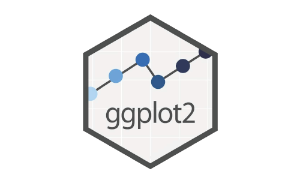
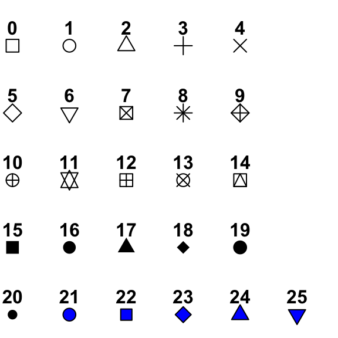
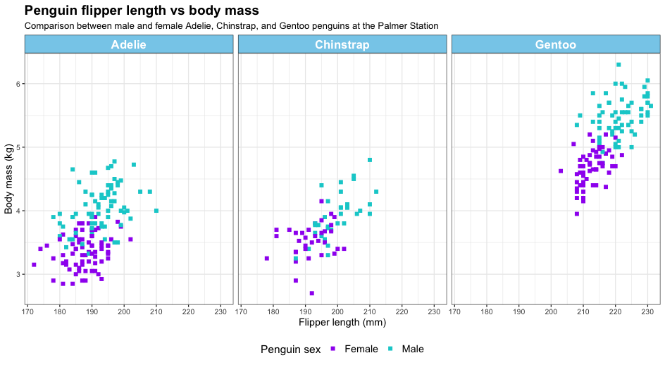

# Data Visualisation {#ch-4} 

```{r ggplot-logo, echo=FALSE, out.width="50%", fig.align='center'}

```

```{r setup-ch4, echo=FALSE, message=FALSE, warning=FALSE}
library(ggplot2)
```

Before starting this chapter, make sure that you have the following R packages installed and loaded.

::: {.yellowbox}
```{r, eval=FALSE}
#Install packages
utils::install.packages("ggplot2") #also installed via tidyverse
utils::install.packages("patchwork")
utils::install.packages("dplyr") #also installed via tidyverse
utils::install.packages("viridis")
```
:::

Remember you only need to install package once in a computer. And after they're installed you can load them into the current R session: 

::: {.yellowbox}
```{r}
#Load packages
base::library(ggplot2)
base::library(patchwork)
base::library(dplyr)
base::library(viridis)

rm(list=ls()); gc()
```
:::

## Basic plotting

There are two main methods for creating plots in R. We will be using the package ggplot2, which uses the grammar of graphics (a framework for building plots from components such as data, aesthetics, and facets), and we will be using some built-in data sets to start plotting.

The data set we are using for this walk-through is called iris and documents the sepal and petal length and width of three different species of iris. It is one of a number of built-in datasets that come with every installation of R, and it looks like this:

::: {.yellowbox}
```{r}
utils::data(iris)  
utils::head(iris) 
```
:::

::: {.pinkbox}
**Explore the data:**
1. What is the range of Sepal.Length?
2. What is the mean of Sepal.Width?
3. What are the names of the three different iris species?
:::

There are many options for how we can plot parts of this data frame, but our first example will be a scatter plot comparing sepal length and sepal width. Each plot should be considered as being made up of a number of layers, so we will build the plot layer by layer.

### Data layer

The first line of any plot using ggplot2 starts with a call to ggplot. This can either be stand-alone as ggplot or we can define some of the key inputs for the plot. With a few exceptions, it is useful to include the dataset within this call to ggplot (either **`ggplot(dataname)`** or **`ggplot(data = dataname)`**). Beyond that, we can also specify some of the aesthetics of the graph - for example, what data is plotted on the x and y axes, and whether there is a grouping that we want to distinguish within the plot by colour, shape, or shading.

We are using the iris dataset and will plot the sepal length against the sepal width in this example, so our code line to set up the base canvas for the plot uses **`data = iris`** and **`aes(x = Sepal.Length, y = Sepal.Width)`**. Both versions of the code below produce the same plot:

::: {.yellowbox}
Code example 1:
```{r}
ggplot2::ggplot(iris, aes(x = Sepal.Length, y = Sepal.Width))
```

Code example 2:
```{r, eval=FALSE}
ggplot2::ggplot(data = iris, aes(x = Sepal.Length, y = Sepal.Width))
```

:::

::: {.pinkbox}
**Try it yourself:**
1. What happens if you remove one of the x or y values in the **`aes`** argument?
2. What happens if you remove the **`aes`** function call entirely? (don't forget to remove the comma after **`iris`**)
3. What happens when you just call ggplot?
:::

It would be possible to add further aesthetics here, but we will cover those further down.

### Plot layer(s)

Now we have a canvas for our plot, but there are no data on it. We use **geoms** to represent the data points. We will demonstrate more examples of these later, but the geom function required to make a scatter plot is `geom_point()`. To use this, we need to have declared an x-value and a y-value as an aesthetic, as we did in Step 1. Then we simply add the function to our base canvas:

::: {.yellowbox}
```{r}
ggplot2::ggplot(iris, aes(x = Sepal.Length, y = Sepal.Width)) +
  geom_point()
```
:::

We can see that there are two groupings in this plot. Since the dataset contains three species of iris, it would be helpful to determine if these groupings are between some of the species or if it's a coincidence. A nice way to do that is by colouring the points according to the species. This would be another aesthetic variable which can either be called in the first call to ggplot or as an argument passed to **`aes`** within `geom_point()`, we have used the latter below:

::: {.yellowbox}
```{r}
ggplot2::ggplot(iris, aes(x = Sepal.Length, y = Sepal.Width)) +
  geom_point(aes(colour = Species))
```
:::

**NOTE: The difference between aesthetics and other ways of formatting**

Above, we have defined a secondary aesthetic, specific to `geom_point()` that says "make the colours of the points be defined by their species". This aesthetic is defined as such because it looks into the dataset for the solution. We could, alternatively, say that we wanted all points to be orange. Orange is not a specific attribute of the dataset, and therefore, we don't specify it as an aesthetic; instead, it is included within the main `geom_point()` function call.

::: {.yellowbox}
```{r}
ggplot2::ggplot(iris, aes(x = Sepal.Length, y = Sepal.Width)) +
  geom_point(colour = "orange")
```
:::

We can see that all points have turned orange, regardless of the underlying species data in this case.

```{r points-symbols, echo=FALSE, fig.cap="An illustration of the different point shapes commonly used in R. The default is number 19, but this can be changed using the `shape = x` parameter, where x is the shape number.", out.width="40%", fig.align='center'}

```

We could decide that we do not want filled circles as our points. There are 25 different shapes (see Figure \@ref(fig:points-symbols)). The default is number 19, which is a single-coloured dot, but we could choose any of the shapes - for example, shape number 3 is a plus sign.

::: {.yellowbox}
```{r}
ggplot2::ggplot(iris, aes(x = Sepal.Length, y = Sepal.Width)) +
  geom_point(aes(colour = Species), shape = 3)
```
:::

It is also possible to make the shape change depending on data within the dataset as an aesthetic or to use any single letter or character from your keyboard instead of one of the preset shapes (try these as an exercise). Finally, the size of each point is not fixed and can be changed in a similar way. As a default, the points are size 1.5, but it is possible to change that number to any positive number. Below, we show an example where we have increased the point size to 3.

::: {.yellowbox}
```{r, eval= FALSE}
ggplot2::ggplot(iris, aes(x = Sepal.Length, y = Sepal.Width)) +
  geom_point(aes(colour = Species), size = 3)
```
:::

::: {.pinkbox}
**Editing the plot layer:**
1. What happens if you make size an aesthetic based on petal width?
2. Shapes 21-25 can take two colours, a "colour" for the edges and a "fill" for the centre. Can you work out how to add your choice of fill?
3. Can you change the shape of the points based on the species of iris?
4. Try to make all the shapes a letter of your choice - remember to include the character within quotation marks.
:::

### Facets

Facets split the single graph into separate but linked graphs by a given grouping. For larger datasets, this can be split into a grid by two different groupings, but for our example, we will just split by the different iris species, like we have done by colour. We can either define this split by defining which grouping sets the rows and/or columns, using **`cols = vars(group)`** / **`rows = vars(group)`**, or it can be defined with an equation **`.~ group`** / **`group~.`** / **`group1~ group2`**. See Table \@ref(tab:precedence) for tilde definition and will be covered further in Section \@ref(sec:simpleLinearRegression). Examples of both options for the iris dataset are below:

::: {.yellowbox}
Example 1
```{r}
ggplot2::ggplot(iris, aes(x = Sepal.Length, y = Sepal.Width)) +
  geom_point(aes(colour = Species), size = 3) +
  facet_grid(cols = vars(Species))
```

Example 2
```{r}
ggplot2::ggplot(iris, aes(x = Sepal.Length, y = Sepal.Width)) +
  geom_point(aes(colour = Species), size = 3) +
  facet_grid(.~Species)
```
:::

::: {.pinkbox}
**Facet options:**
1. What happens if you set **`scales = "free_x"`** or **`scales = "free_y"`** or **`scales = "free"`**?
2. What happens if you try the same arguments with **`space`**?
3. Is **`cols = vars(Species)`** equivalent to **`.~Species`** or **`Species~.`**?
:::

### Making it all look pretty

#### Background and theme

All plots up to this point were created using ggplot's default theme. You can change this to alter the plot background. Below, I will give you a few examples of this. You can also click here to explore more of the themes: <https://ggplot2.tidyverse.org/reference/ggtheme.html>. Below is the first plot, which shows the default theme for ggplot2 graphs.

::: {.yellowbox}
```{r}
ggplot2::ggplot(iris, aes(x = Sepal.Length, y = Sepal.Width)) +
  geom_point(aes(colour = Species), size = 3) 
```
:::

Below is the second plot, which shows the black and white theme for ggplot2 graphs. The plot now has a white background with grid markers.

::: {.yellowbox}
```{r}
ggplot2::ggplot(iris, aes(x = Sepal.Length, y = Sepal.Width)) +
  geom_point(aes(colour = Species), size = 3)+
  theme_bw()
```
:::

Below is the third plot, which illustrates the classic theme for ggplot2 graphs. The plot now has a white background and no grid markers.

::: {.yellowbox}
```{r}
ggplot2::ggplot(iris, aes(x = Sepal.Length, y = Sepal.Width)) +
  geom_point(aes(colour = Species), size = 3)+
  theme_classic()
```
:::

Below is the fourth plot, which shows the dark theme for ggplot2 graphs.

::: {.yellowbox}
```{r}
ggplot2::ggplot(iris, aes(x = Sepal.Length, y = Sepal.Width)) +
  geom_point(aes(colour = Species), size = 3)+
  theme_dark()
```
:::

Below is the fifth plot, which shows all of the themes we have covered so far - this includes the default, bw, classic and dark. These were plotted together using another R package that we will discuss further on.

::: {.yellowbox}
```{r}
library(patchwork)
p_base<- ggplot2::ggplot(iris, aes(x = Sepal.Length,y = Sepal.Width))+
  geom_point(aes(color = Species), size = 3)

# shows all of the plots together using Patchwork Package
p1 <- p_base + ggtitle("Default Theme") + 
  theme(legend.position = "none")
p2 <- p_base + theme_bw() + ggtitle("Theme_bw()") + 
  theme(legend.position = "right")
p3 <- p_base + theme_classic() + ggtitle("Theme_classic()")+ 
  theme(legend.position = "none")
p4 <- p_base + theme_dark() + ggtitle("Theme_dark()")+ 
  theme(legend.position = "right")

# patchwork
(p1|p2)/(p3|p4)
```
:::

Below is a plot that highlights how you can manually change the panel background, plot background and other elements, including the line colour (major and minor), and the axes text colour.

::: {.yellowbox}
```{r}
ggplot2::ggplot(iris, aes(Sepal.Length, Sepal.Width)) +
  geom_point() +
  theme(
    panel.background = element_rect(fill = "hotpink"),
    plot.background = element_rect(fill = "skyblue"),
    panel.grid.major = element_line(color = "brown",
                                    linewidth = 1),
    panel.grid.minor = element_line(color = "limegreen", 
                                    linewidth = 0.5),
    text = element_text(color = "purple")
  )
```
:::

::: {.pinkbox}
**Background and theme options:**
1. Look up other themes. What is your favourite theme which you might use by default?
2. Can you use the different theme options in the last example to make a theme based on your favourite film (ours may draw inspiration from Barbie)?
:::

#### Renaming axes

By default, ggplot2 uses the column names used in the aesthetic calls to name the axes; however, that is not always the most useful. In our examples so far, the x-axis has been labelled **`"Sepal.Length"`** and the y-axis has been labelled **`"Sepal.Width"`**. Whilst this is sufficient to describe the data, it could be more descriptive. We can easily rename the axes in ggplot2 using the **`labs`** layer. Within **`labs`** we can change either of the axes, and we can also add a title to the plot and adjust the title of the legend. Note that to change the title of the legend, you have to refer to it as the aesthetic (e.g. **`colour`** or **`fill`**).

You can also use additional functions to make further edits. Here we will demonstrate the function `scale_x_continuous()` which can change aspects of the x-axis. It has an analogous function (`scale_y_continuous()`) that does the same for the y-axis. We are defining three aspects within `scale_x_continuous()`: the breaks, the labels, and the limits. The breaks tell ggplot2 where to place the tick labels. Without any further adjustment, the numbers in breaks will define both the position and the label for each tick. Labels adjust what is written at each tick mark. We have changed the labels from integer numbers to **`"four, five, six, seven, and eight"`**. The limits enable us to define how long we want the axes to be. This can be wider than the data, meaning that there is empty space outside of the data, or can be thinner than the data, meaning some data are not visualised. In the following, we have slightly extended the axes in both directions using **`limits = c(3.5,8.5)`**.

::: {.yellowbox}
```{r}
ggplot2::ggplot(iris, aes(x = Sepal.Length, y = Sepal.Width))+
  geom_point(aes(color = Species))+
  labs(title = "Sepal Dimensions in Iris Dataset",
       x = "Sepal Length (cm)",
       y = "Sepal Width (cm)", 
       color = "Iris Species")+
  scale_x_continuous(breaks = c(4, 5, 6, 7, 8),
                     labels = c("Four", "Five", "Six", "Seven", "Eight"),
                     limits = c(3.5,8.5)) + 
  theme_bw()
```
:::

::: {.pinkbox}
**Axes options:**
1. Can you shrink the x-axis so that only data between 5 and 7cm are shown?
2. Can you increase the y-axis to include negative numbers?
3. Can you change the title of the plot and the legend?
:::

### Different Types of Plots

Here we have several types of plots that are useful for visualising different types of data.

#### Histogram

Histograms are useful for showing the distribution of a single numeric variable. This version shows the bars side by side by species within each bin, making it easier to directly compare counts for each species.

::: {.pinkbox}
**Layout in histograms:**
Look at the plot below
1. What happens if you change the **`position`** argument from 'dodge' to 'stack'?
2. Change the **`binwidth`** to values between 0.2 and 1.5 - what is the most useful binwidth?
3. If you change the **`position`** from 'dodge' to 'identity' the bars should all overlap - can you change the alpha value or the fill and colour values to make it clearer how they overlap?
:::

::: {.yellowbox}
```{r}
ggplot2::ggplot(iris, aes(x = Sepal.Length, fill = Species)) + 
  geom_histogram(binwidth = 0.6, 
                 color = 'black', alpha = 0.8, position = 'dodge')+
  labs(title = "Dodged Histogram of Sepal Length by Species")+
  theme(plot.title = element_text(size = 16, face = "bold"))
```
:::

#### Box plots

Box plots are great for visualising the spread of data and identifying outliers in continuous data across categories.

::: {.yellowbox}
```{r}
ggplot2::ggplot(iris, aes(x = Species, 
                          y = Sepal.Length, 
                          fill = Species))+
  geom_boxplot(color = 'black', alpha = 0.8)+
  labs(title = "Boxplot of Sepal Length by Species")+
  theme(plot.title = element_text(size = 16, face = "bold"))
```
:::

::: {.pinkbox}
**Layout in box plots:**
1. Can you make the lines in the box plot turn the same colour as the box fill? Why is this not the best of ideas?
2. If you decide the lines are too thin, you can add in an argument (not an aesthetic) to **`geom_boxplot`** called **`linewidth`**.
:::

#### Scatter plots

These are ideal for showing relationships between two continuous variables.

::: {.yellowbox}
```{r}
ggplot2::ggplot(iris, aes(x = Sepal.Length, y = Sepal.Width)) +
  geom_point(aes(colour = Species), size = 3) +
  labs(title = "Scatter plot of Sepal Length/Width by Species")+
  theme(plot.title = element_text(size = 16, face = "bold"))
```
:::

#### Bar Charts

Bar charts are used for comparing quantities across discrete categories.

::: {.yellowbox}
```{r}
iris_means <- stats::aggregate(Sepal.Length ~ Species, 
                               data = iris, FUN = mean)

ggplot2::ggplot(iris_means, aes(x = Species, 
                                y = Sepal.Length, 
                                fill = Species)) +
  geom_col(color = 'black', alpha = 0.8) +
  labs(title = "Mean Sepal Length per Species", 
       y = "Mean Sepal Length") +
  theme(plot.title = element_text(size = 16, face = "bold"))
```
:::

#### Bar Charts with Error Bars

Here we include error bars. Error bars are graphical representations of the variability or uncertainty in the data. They provide insights into the precision of measurements or the confidence in estimates like means. In bar charts, adding error bars can help people to understand the range within which the true value likely falls.

For example, when plotting the mean Sepal Length by species in the iris dataset, we can add error bars to show the **\acr{SD}** or **\acr{SE}** within each species group.

::: {.yellowbox}
```{r}
base::library(dplyr)
iris_summary <- iris %>% dplyr::group_by(Species) %>% 
  dplyr::summarise(mean_sepal = base::mean(Sepal.Length),
                   se_sepal = stats::sd(Sepal.Length) /base::sqrt(n()))
```
:::

::: {.yellowbox}
```{r}
ggplot2::ggplot(iris_summary, aes(x = Species, y = mean_sepal, fill = Species)) + 
  geom_col(color = 'black', alpha = 0.8) + 
  geom_errorbar(aes(ymin = mean_sepal - se_sepal, 
                    ymax = mean_sepal + se_sepal), 
                width = 0.2, color = "black") +
  labs(title = "Mean Sepal Length per Species with **\acr{SE}**", 
       y = "Mean Sepal Length") +
  theme(plot.title = element_text(size = 16, face = "bold"))
```
:::

#### Faceted Plots {#sec:facetedPlots}

Here, we can break the data into subsets and plot each subset in its own panel for comparison.

::: {.yellowbox}
```{r}
ggplot2::ggplot(iris, aes(x = Sepal.Length, y = Sepal.Width, fill = Species))+ 
  geom_point(shape = 21, color = 'black', size = 2)+
  facet_wrap(~Species)+
  labs(title = "Sepal Length vs Width by Species", 
       x = "Sepal Length", y = "Sepal Width")+
  theme(plot.title = element_text(size = 16, face = "bold"),
        strip.text = element_text(face = "bold"))
```
:::

#### Viridis Colour Palettes

This is an example of how you can use a colour palette in R. Further examples using the `viridis` package can be found here.

::: {.yellowbox}
```{r, eval=FALSE}
#base::library(ggplot2)
#base::library(viridis)
ggplot2::ggplot(iris, aes(x = Sepal.Length, y = Sepal.Width, fill = Species)) +
  geom_point(shape = 21, color = "black", size = 2) +
  facet_wrap(~ Species) +
  scale_fill_viridis(option = "plasma", discrete = T) +  
  labs(title = "Sepal Length vs Width by Species with Viridis Palette",
       x = "Sepal Length", y = "Sepal Width")  +
  theme(plot.title = element_text(size = 18, face = "bold"),
        strip.text = element_text(face = "bold", size = 12))
```
:::

## Individualising your plots

### Colours

We have already shown an example of the viridis colour palette. This set of palettes is designed to be printer and colour-blind friendly. In the example above, we used the "plasma" palette for a discrete selection of data, but all palettes are continuous, and the default for the functions `scale_fill_viridis()` and `scale_colour_viridis()` are for continuous data. More details on the different palettes available through viridis are available here: <https://cran.r-project.org/web/packages/viridis/vignettes/intro-to-viridis.html#the-color-scales>.

Another similar package that provides different palettes is RColorBrewer. Within ggplot, this can be called, similar to viridis, with the functions `scale_colour_brewer()` and `scale_fill_brewer()`. More information about the colour palettes from RColorBrewer are available here: <https://colorbrewer2.org>

Sometimes, you just want to define your own palette for plots, and there are many different packages and resources to help select colours. Some of our favourites include:

1. MetBrewer (<https://www.blakerobertmills.com/my-work/met-brewer>) - palettes based on objects in the Metropolitan Museum of Art in New York
2. coolors (<https://coolors.co/generate>) - generates new palettes with the click of a space bar
3. PNWColors (<https://github.com/jakelawlor/PNWColors>) - palettes based on Washington state and the Pacific Northwest of the USA
4. WesAnderson (<https://github.com/karthik/wesanderson>) - palettes based on Wes Anderson films

It is also worth checking that any palettes you choose are colour-blind friendly. RColorBrewer, viridis, and coolors all are, or have options to easily check, but if you are selecting from other packages or choosing colours by hand, you can use the package colorblindcheck.

To colour sections with your own colours, not from a palette, you need to first define your palette and then use `scale_fill_manual()` or `scale_colour_manual()`, as shown below:

::: {.yellowbox}
```{r, eval=FALSE}
SpecCols <- c(setosa = "#A3D9FF", versicolor = "#7E6B8F", virginica = "#96E6B3")
ggplot2::ggplot(iris, aes(x = Sepal.Length, y = Sepal.Width, colour = Species)) +
  geom_point(size  = 3) +
  scale_colour_manual(values = SpecCols) +  
  labs(x = "Sepal Length", y = "Sepal Width")  +
  theme_light() +
  theme(plot.title = element_text(size = 18, face = "bold"),
        strip.text = element_text(face = "bold", size = 12))
```
:::

If you use a named list (as above), the colours will match the names provided, regardless of the order in which they are listed. However, if you provide only a list of hex values, R will match up to the order of the groupings (automatically in alphabetical order).

::: {.pinkbox}
**Playing around with colours:**
1. Can you create your own palette and apply it to one of the other plot types shown above?
2. What constitutes a good palette, what constitutes a bad palette?
3. Try to use colour as a continuous variable for one of the width or length measurements with a viridis palette. Do you have a favourite?
:::

### Changing the position of the legend

The legend automatically appears on the right side of the plot, but is movable. There are four built-in arguments: **`"top"`**, **`"bottom"`**, **`"left"`**, and **`"right"`**. The resulting layout of each of those is shown below.

::: {.yellowbox}
```{r, eval=FALSE}
a = ggplot2::ggplot(iris, aes(x = Sepal.Length, y = Sepal.Width)) +
  geom_point(aes(color = Species))

(a + theme(legend.position = "left") + ggtitle("Left")) +
  (a + theme(legend.position = "right") + ggtitle("Right")) +
  (a + theme(legend.position = "top") + ggtitle("Top")) +
  (a + theme(legend.position = "bottom") + ggtitle("Bottom")) 
```
:::

We have used **`theme(legend.position(...))`** for these position changes, but it is also possible to use **`guides(colour = guide_legend(position = "bottom"))`**. Using the function guides, it is also possible to define a position of **`"inside"`**. This moves the legend from outside the plot to inside the plot, defaulting to the centre. To adjust the position, assume the plot is a 1x1 box with corners at (0,0), (1,0), (1,1), and (0,1). The position of the inside legend can be anywhere within that box, regardless of the data the plot is showing. Defining that position uses the **`theme(legend.position.inside=c(...))`** function. 

::: {.yellowbox}
```{r, eval=FALSE}
a = ggplot2::ggplot(iris, aes(x = Sepal.Length, y = Sepal.Width)) +
  geom_point(aes(color = Species)) +
  guides(colour = guide_legend(position = "inside"))

(a + theme(legend.position.inside = c(0,0)) + ggtitle("bottom left")) +
  (a + theme(legend.position.inside = c(1,1)) + ggtitle("top right")) +
  (a + theme(legend.position.inside = c(0.5,0.5)) + ggtitle("middle")) +
  (a + theme(legend.position.inside = c(0.3, 0.8)) + ggtitle("upper left")) 
```
:::

### Changing the Font

To make your plots easier to read, you can alter your font, font style, and size. I will give you some examples below. These can also be applied to the facets; click below for more information:

<https://www.datanovia.com/en/blog/how-to-change-ggplot-facet-labels/>

I have changed the following: 
1. The title to **bold, italic and the font serif**.
2. The x-axis title to just **bold and the font sans**.
3. The y-axis title to just **italic and the font mono**.
4. The legend title to just **bold and the font Times**.

::: {.yellowbox}
```{r, eval=FALSE}
ggplot2::ggplot(iris, aes(x = Sepal.Length, y = Sepal.Width)) +
  geom_point(aes(color = Species)) +
  labs(
    title = "Sepal Dimensions in Iris Dataset",
    x = "Sepal Length (cm)",
    y = "Sepal Width (cm)",
    color = "Iris Species"
  ) +
  theme_bw() +
  theme(
    plot.title = element_text(size = 20, face = "bold.italic", family = 'serif'),
    axis.title.x = element_text(size = 14, face = "bold", family = 'sans'),
    axis.title.y = element_text(size = 14, face = "italic", family = 'mono'),
    legend.title = element_text(size = 12, face = "bold", family = 'Times')
  )
```
:::

### Changing the Font but in Facets

We can also change the font type or style in a facet as well as the background colour.

I have changed the following: 
1. The background colour of the facet label = **`light-blue`**.
2. The colour of the facet title text = **`darkgreen`**.
3. The text box outline for the facet label = **`red`**.
4. The facet label is now **`bold.italic`**.
5. The font is now **`sans`** and size **`14`**. 

::: {.yellowbox}
```{r, eval=FALSE}
ggplot2::ggplot(iris, aes(Sepal.Length, Sepal.Width, color = Species)) +
  geom_point(size = 3) +
  facet_wrap(~ Species) +
  theme(strip.text = element_text(
    family = "sans", size = 14,  
    face = "bold.italic", color = "darkgreen"
  ),
  strip.background = element_rect(
    fill = "light-blue", color = "red", linewidth = 1)
  )
```
:::

### Combining plots {#sec:CombiningPlots}

The patchwork package is the simplest package to use if you want to combine multiple graphs into one plot. Save each graph as an object (**`graph1 <- ggplot(...) + ...`**) and then add each of the graphs together at the end (**`graph1 + graph2 + graph3 + graph4`**). You can gain more control over the plot by using **`|`** for plots that you want next to each other and **`/`** to separate plots that sit above and below each other. As some examples:

**`A + B + C + D`** and **`(A + B)/(C + D)`** and **`(A/C) | (B/D)`** will all produce the same plot layout:

|   |   |
|:-:|:-:|
| A | B |
| C | D |

However, **`A + B/C + D`** would give:

|   |   |   |
|:-:|:-:|:-:|
| A | B | D |
|   | C |   |

And **`A/(B + C + D)`** would give:

|   | A |   |
|:-:|:-:|:-:|
| B | C | D |

For more information on patchwork and further ways of combining plots, visit the website <https://patchwork.data-imaginist.com/>.

There are other packages that can help combine different plots, such as cowplot. Instead of adding your plots together, with cowplot you use the function `plot_grid(A,B,C,D)` which will give you the same output as the first patchwork example.

### Saving your plot

Once you have created your perfect plot, you want to save it to use outside of R, such as in presentations and reports. The important function is `ggsave`. As a minimum, you need to have a file path to save the plot. This should point directly to the folder you want to save to and include the filename you want to save it as, and the file extension. The file extension can be any of the following: .eps, .ps, .tex, .pdf, .jpeg, .tiff, .png, .bmp, .svg.

`ggsave` automatically assumes that the last plot you ran code for is the one that you want to save. If this is not the case, and you have saved a specific graph to the environment, you can add an argument of **`ggsave("filepath/filename.png", plot = plotA)`**. Other arguments you can add include: width and height, units (can be any of in, cm, mm, or px), **\acr{DPI}**, and **`bg`** (if you want to change the background colour of the plot). There are also other arguments you can add, but these are used less often.

::: {.pinkbox}
**Saving a plot:**
1. Can you save one of your plots using **`ggsave`**?
2. Can you save it in another format?
3. What happens if you change the height, width, or **\acr{DPI}**?
:::

## Perfect Palmer Penguins Plot

::: {.pinkbox}
**Challenge**
We have created a plot using aspects of ggplot2 covered above.
1. Can you recreate this plot?
2. Can you improve on this plot?
:::

```{r palmerpenguins-logo, echo=FALSE, out.width="23%", fig.align='center'}
knitr::include_graphics("images/04-palmerpenguins.png")
```

Before you begin:
1. install the palmer penguins package (**`install.packages("palmerpenguins")`**)
2. load the palmer penguins package (**`library(palmerpenguins)`**)
3. the colours used in this plot are **"skyblue"**, **"darkturquoise"**, and **"purple"**
4. it is possible to remove data with **\acr{NA}** values from the legend using **`na.translate = FALSE`**

There isn't just one answer to correctly recreate this graph, but it is possible to do it with just the ggplot2 skills acquired above.

```{r palmerspenguins-plot, echo=FALSE, out.width="100%", fig.cap="Example of plots created using `palmerspenguins`. Can you recreate this or improve on it?", fig.align='center'}

```

```{r, echo = FALSE}
ggplot2::ggplot(penguins, aes(x = flipper_len, y = body_mass, colour = sex)) +
  geom_point(shape = 15, size = 2) +
  facet_grid(~species)+
  theme_bw() +
  labs(
    x = "Flipper length (mm)", y = "Body mass (kg)", colour = "Penguin sex", 
    title = "Penguin flipper length vs body mass",
    subtitle = paste( # Breaking down subtitle that is too long
      "Comparison between male and female Adelie,", 
      "Chinstrap, and Gentoo penguins at the Palmer Station"
    )
  ) +
  scale_y_continuous(breaks = c(3000, 4000, 5000, 6000), labels = c(3,4,5,6)) +
  scale_colour_manual(
    values = c("purple", "darkturquoise"), 
    na.translate = FALSE, 
    labels = c("female" = "Female", "male" = "Male")
  ) +
  theme(legend.position = "bottom", strip.background = element_rect(fill = "skyblue"), 
        strip.text = element_text(face = "bold", colour = "white", size = 14),
        plot.title = element_text(size = 16, face = "bold"),
        axis.title = element_text(size = 12),
        legend.text = element_text(size = 12),
        legend.title = element_text(size = 13))
```