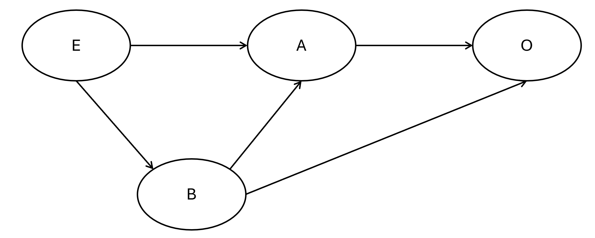
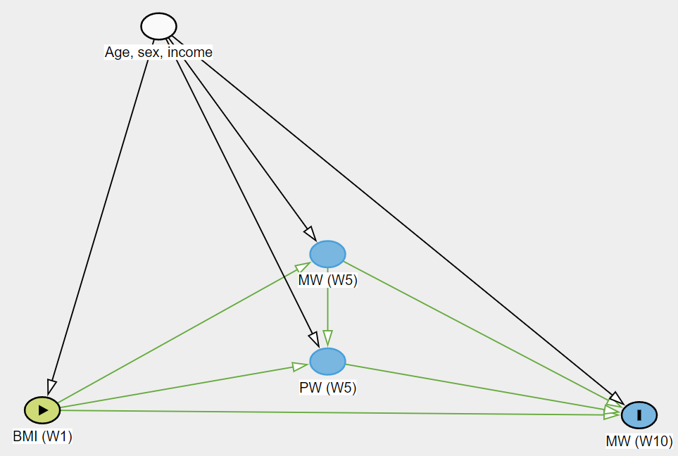

# Causal Inference: Mediation and Instrumental Variables {#ch-7}

In previous chapters, we focused on establishing associations between variables. However, in health data science, we often want to understand the *causal* mechanisms driving these associations. This chapter introduces two advanced causal inference techniques: **mediation analysis** (to understand *how* an exposure affects an outcome) and **instrumental variable variables** (to estimate causal effects in the presence of unmeasured confounding).

The mediation analysis will be based on the `CMAverse` package which is not available from the **CRAN** (the official repository for R packages) but could be installed from **Github** (a commonly used developer maintained respository) using the following command. You may not have the `devtool` installed on your computer yet. If that's the case, please install it first. 

::: {.yellowbox}
```{r, eval=FALSE}
devtools::install_github("BS1125/CMAverse")
```
:::

::: {.yellowbox}
```{r setup-ch7, message=FALSE, warning=FALSE}
library(tidyverse)
library(gtsummary)
library(bda) 
library(AER)
library(CMAverse) 
```
:::

## Data Preparation for Causal Modeling

When investigating causal pathways, the timing of measurements is critical. An exposure must precede a mediator, which in turn must precede the outcome. Therefore, longitudinal data is typically required. You could, technically, use mediation analysis to analyse cross-sectional data, but the estimated 'effects' could reflect (partly) reverse cauation. 

In the mediation analysis, we will still be focusing on the Understanding Society longitudinal data. The primary hypothesis was to examine whether **\acr{PW}** (mediator) could be a mechanism between **\acr{BMI}** (exposure) and **\acr{MW}** (outcome). 

::: {.yellowbox}
```{r data-prep-cleaning}
# 1. Raw data import and reshaping
dat <- read_csv('./data/06-understanding_soc.csv') 
```
:::

As usual, it is essential to inspect the descriptive statistics before conducting more complex models. We use the `statistic` argument to specify that we want the mean and **\acr{SD}** for all continuous variables, and the `digits` argument to round the results neatly.

::: {.yellowbox}
```{r descriptive-stats}
# Generate descriptive statistics table
tbl_summary(
  dat, 
  statistic = list(all_continuous() ~ '{mean} ({sd})'), 
  digits = list(all_continuous() ~ c(1, 1), 
                all_categorical() ~ c(0, 1))
)
```
:::

## Mediation Analysis

Mediation analysis attempts to unpack the **Total Effect** of an exposure on an outcome into two parts:
1. **Direct Effect:** The effect of the exposure directly on the outcome.
2. **Indirect Effect:** The effect of the exposure on the outcome that passes *through* a third variable (the mediator).

### The Base Model (Total Effect)

Before looking for a mediator, we establish the baseline association. Here, we model mental wellbeing at Wave 9 (`mw9`) based on baseline **\acr{BMI}** (`bmi`), adjusting for sociodemographic confounders and baseline wellbeing.

::: {.yellowbox}
```{r rq1-base-model}
# Base model predicting Wave 9 mental wellbeing
m0 <- lm(mw9 ~ bmi + age + sex + income + mw1 + pw1, data=dat)
tbl_regression(m0)
```
:::

### Difference Method for Mediation

The simplest way to check for mediation is the **"difference method"**. It is simply done by adding the candidate mediator (\acr{PW} at Wave 5, `pw5`) into the regression model. If \acr{PW} mediates the relationship between **\acr{BMI}** and \acr{MW}, the coefficient for **\acr{BMI}** should attenuate noticeably in the new model compared with the base model. 

The codes below fit a second linear model (`m1`) that includes `pw5`. We then use `gtsummary::tbl_merge()` to put both models side-by-side for easy visual comparison. Minimal differences between the **\acr{BMI}** coefficients across the two models suggest minimal mediation.

::: {.yellowbox}
```{r rq2-regression-adj}
# Adjusted model including the mediator (pw5)
m1 <- lm(mw9 ~ bmi + age + sex + income + pw5 + mw1 + pw1, data=dat)

# Merge tables for side-by-side comparison
tbl_merge(
  list(tbl_regression(m0), tbl_regression(m1)), 
  tab_spanner = c('Not adjusted for PW', 'Adjusted for PW')
)
```
:::

### Sobel Test

The Sobel test is a traditional statistical test to determine if the indirect effect is significantly different from zero. The codes below use `bda::mediation.test(mediator, exposure, outcome)` to conduct the Sobel test. *Warning:* This test is rudimentary and does not adjust for any confounders. It is not recommended for observational health data unless you are absolutely certain no confounding exists.

::: {.yellowbox}
```{r sobel-test}
with(dat, mediation.test(pw5, bmi, mw9))
```
:::

### Parametric G-Formula

Sobel test is unadjusted so rarely applicable. The difference method also has several limitations: 
  1. Only applicable for linear or count regression. Linear and Poisson models are called 'collapsible' meaning that the coefficient of a variable would not change when an additional, unrelated, variable is added in. Logistic and Cox regressions are 'non-collapsible', meaning that coefficients would 'naturally' change whenever an additional variable is added in, even if that additional variable is unrelated to the exposure. 
  2. These regression models do not handle **exposure-induced mediator-outcome confounder**. See figure below. E is exposure; O is outcome; A is mediator of interest. B is also a mediator between E and O, but confounds the relationship between M and O. Regression difference methods cannot address the influence of B. 

```{r dag1, echo=FALSE, out.width="50%", fig.align='center'}

```

Modern causal inference relies on more robust methods, such as the parametric g-formula (also known as g-computation), which can handle complex confounding scenarios (including interactions between the exposure and the meditor). In R, we use the `cmest()` function from the `CMAverse` package.

#### Without Exposure-Induced Confounders

The `cmest()` function is quite complex in that it does not use the formula for models, and a larger number of input is required to get it to work. Below breaks down the input: 

* `model` specify the models to be run. We will need gformula here as it can address exposure-induced mediator-outcome confounder. 
* `mreg` and `yreg`: Specify the regression types for the mediator and outcome models (e.g., 'linear' or 'logistic').
* `exposure`, `mediator` and `outcome` are self-explanatory - just the variable names for these causal roles.
* `basec` is the baseline confounders. 
* `a` is the intervention value and `astar` is the reference value. While the exposure variable is numeric, cmest needs these two to caulate the total, direct and indirect effect. The total effect for this code below is, therefore, comparing 26.69 (mean in this sample) with the overweight cut-off (25). 
* `mval` is the reference value for the mediator, similar to what `astar` does. 
* `mreg` and `yreg` indicate the regression you want to use for the simulation. It usually depends on the variable type of the mediator and the outcome. 
* `EMint=FALSE`: Specifies that we are not evaluating exposure-mediator interaction. 

::: {.yellowbox}
```{r gformula-no-confounder}
library(CMAverse)
# G-formula mediation analysis
mm1 <- cmest(
  data = dat, 
  model = 'gformula', 
  exposure = 'bmi', 
  mediator = 'pw5', 
  outcome = 'mw9', 
  basec = c('age', 'sex', 'income', 'mw1', 'pw1'), 
  a = 26.69, 
  astar = 25, 
  mreg = list('linear'), 
  mval = list(50), 
  yreg = 'linear', 
  EMint = FALSE
) 

summary(mm1)
```
:::

The results are consistent with the difference method - no mediation. It is not surprising because we have not done anything different from the difference method. 

#### With Exposure-Induced Confounders

Suppose if we think \acr{MW} at wave 5 could confound the relationship between \acr{PW} at wave 5 and \acr{MW} at wave 10: 

```{r dag2, echo=FALSE, out.width="50%", fig.align='center'}

```

This can be modelled by adding one more argument to the `cmest()` function - the `postc`. It is to specify the intermediate (post-exposure) confounder (`mw5`). We also must tell the function how to model this intermediate variable using the `postcreg` argument (here, as a 'linear' regression).

::: {.yellowbox}
```{r gformula-confounder}
mm2 <- cmest(
  data = dat, 
  model = 'gformula', 
  exposure = 'bmi', 
  mediator = 'pw5', 
  outcome = 'mw9', 
  basec = c('age', 'sex', 'income', 'mw1', 'pw1'), 
  postc = c('mw5'),       # The exposure-induced confounder
  a = 26.69, 
  astar = 25, 
  mreg = list('linear'), 
  mval = list(50), 
  postcreg = list('linear'), # Regression model for the confounder
  yreg = 'linear', 
  EMint = FALSE
) 

summary(mm2)
```
:::

The indirect effect becomes significant and was estimated to mediate about 1/3 of the total effect. This contradicts with the previous results, and which one is more accurate would depend on how likely \acr{MW} at wave 5 is a confounder. 

## Instrumental Variables (IV)

In observational data, or in clinical trials with non-compliance, unmeasured confounding can severely bias our effect estimates. Instrumental Variable (IV) analysis offers a workaround. An "instrument" is a variable that is strongly associated with the exposure, but has *no direct pathway* to the outcome except through the exposure itself. 

In a Randomized Controlled Trial (RCT) with poor adherence, the randomized `group` assignment is the perfect instrument: it dictates whether someone *should* exercise, but only the *actual attendance* impacts their stress levels.

### Intention-to-Treat (ITT) vs. Per-Protocol (PP)

1. **ITT Analysis:** We analyze patients based purely on the group they were randomized to, regardless of whether they actually attended the exercise sessions. This is statistically safe from confounding but usually underestimates the true biological effect of the intervention.
2. **Per Protocol (PP) Analysis:** We analyze patients based on their actual attendance. While this looks at the "true" intervention, it is heavily confounded (e.g., highly motivated people might attend more *and* have naturally lower stress).

::: {.yellowbox}
```{r itt-and-pp-analysis}
dat_iv <- read_csv('./data/07-iv.csv')

# 1. Intention-to-Treat (Conservative, unconfounded)
summary(lm(stress ~ group, data=dat_iv))

# 2. Per Protocol (Confounded by adherence behaviors)
summary(lm(stress ~ attendance, data=dat_iv))
```
:::

You could see from the codes above the PP analysis esimated the intervention to be twice as effect than in the ITT analysis. But how true is that? 


### IV Analysis using 2-Stage Least Squares

IV analysis extracts the variation in `attendance` that is purely driven by the randomization `group` (the instrument), effectively purging the confounding noise from the model. 

We use the `ivreg()` function from the `AER` package. The formula `stress ~ attendance | group` is read as: model the outcome (`stress`) against the exposure (`attendance`), using the variable after the pipe (`group`) as the instrument. 
We also test the strength of the instrument using `anova()`. An F-statistic > 10 generally indicates a strong instrument. Because `group` is a randomized allocation, it safely meets the exclusion criteria.

::: {.yellowbox}
```{r iv-analysis}
library(AER)

# Fit the Instrumental Variable regression
iv_model <- ivreg(stress ~ attendance | group, data=dat_iv)
summary(iv_model)

# Check instrument strength (F-statistic)
anova(glm(attendance ~ group, data=dat_iv), test='F')
```
:::

Indeed, the IV analysis found a result between the ITT and PP - the true effect of intervention is strong than the ITT (because not everyone complied fully) but not as strong as the PP (because compliance is confounded). 